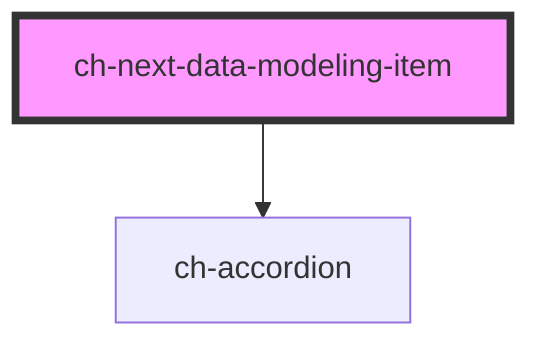

# ch-next-data-modeling-item

<!-- Auto Generated Below -->

## Properties

| Property            | Attribute             | Description                                                                                                           | Type      | Default |
| ------------------- | --------------------- | --------------------------------------------------------------------------------------------------------------------- | --------- | ------- |
| `addNewEntityMode`  | `add-new-entity-mode` | `true` to only show the component that comes with the default slot. Useful when the item is the last one of the list. | `boolean` | `false` |
| `deleteButtonLabel` | `delete-button-label` | The label of the delete button. Important for accessibility.                                                          | `string`  | `""`    |
| `description`       | `description`         | The description of the entity.                                                                                        | `string`  | `""`    |
| `editButtonLabel`   | `edit-button-label`   | The label of the edit button. Important for accessibility.                                                            | `string`  | `""`    |
| `name`              | `name`                | The name of the entity.                                                                                               | `string`  | `""`    |

## Events

| Event               | Description                             | Type               |
| ------------------- | --------------------------------------- | ------------------ |
| `deleteButtonClick` | Fired when the delete button is clicked | `CustomEvent<any>` |
| `editButtonClick`   | Fired when the edit button is clicked   | `CustomEvent<any>` |

## Slots

| Slot      | Description                                        |
| --------- | -------------------------------------------------- |
| `"items"` | The first level items (entities) of the data model |

## Dependencies

### Depends on

- [ch-accordion](../../accordion)

### Graph

----------------------------------------------

*Built with [StencilJS](https://stenciljs.com/)*
