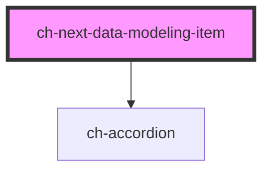

# ch-next-data-modeling-item

<!-- Auto Generated Below -->

## Properties

| Property           | Attribute            | Description                                                                                                                   | Type                                                                                                                                                                                                                                                                                        | Default     |
| ------------------ | -------------------- | ----------------------------------------------------------------------------------------------------------------------------- | ------------------------------------------------------------------------------------------------------------------------------------------------------------------------------------------------------------------------------------------------------------------------------------------- | ----------- |
| `addNewFieldMode`  | `add-new-field-mode` | `true` to only show the component that comes with the default slot. Useful when the item is the last one of the list.         | `boolean`                                                                                                                                                                                                                                                                                   | `false`     |
| `captions`         | --                   | The labels used in the buttons of the items. Important for accessibility.                                                     | `{ ATT: string; ENTITY: string; LEVEL: string; adding: string; addNewEntity: string; addNewField: string; cancel: string; collection: string; confirm: string; edit: string; editing: string; delete: string; deleting: string; deleteMode: string; newEntity: string; newField: string; }` | `undefined` |
| `dataType`         | `data-type`          | The dataType of the field.                                                                                                    | `string`                                                                                                                                                                                                                                                                                    | `""`        |
| `disabled`         | `disabled`           | This attribute lets you specify if the element is disabled. If disabled, it will not fire any user interaction related event. | `boolean`                                                                                                                                                                                                                                                                                   | `false`     |
| `entityNameToATTs` | --                   | This property maps entities of the current dataModel with their corresponding ATTs.                                           | `{ [key: string]: string[]; }`                                                                                                                                                                                                                                                              | `{}`        |
| `errorTexts`       | --                   | The error texts used for the new field input.                                                                                 | `{ Empty: string; AlreadyDefined1: string; AlreadyDefinedEntity1: string; AlreadyDefined2: string; }`                                                                                                                                                                                       | `undefined` |
| `fieldNames`       | --                   | This property specifies the defined field names of the current entity.                                                        | `string[]`                                                                                                                                                                                                                                                                                  | `[]`        |
| `level`            | `level`              | This property specifies at which collection level the field is located.                                                       | `0 \| 1 \| 2`                                                                                                                                                                                                                                                                               | `1`         |
| `maxAtts`          | `max-atts`           | Determine the maximum amount of ATTs displayed per entity.                                                                    | `number`                                                                                                                                                                                                                                                                                    | `3`         |
| `name`             | `name`               | The name of the field.                                                                                                        | `string`                                                                                                                                                                                                                                                                                    | `""`        |
| `type`             | `type`               | The type of the field.                                                                                                        | `"ATT" \| "ENTITY" \| "LEVEL"`                                                                                                                                                                                                                                                              | `"LEVEL"`   |

## Events

| Event         | Description                                    | Type                                                    |
| ------------- | ---------------------------------------------- | ------------------------------------------------------- |
| `deleteField` | Fired when the item is confirmed to be deleted | `CustomEvent<any>`                                      |
| `editField`   | Fired when the item is edited                  | `CustomEvent<{ name: string; type?: EntityItemType; }>` |
| `newField`    | Fired when a new file is comitted to be added  | `CustomEvent<{ name: string; type?: EntityItemType; }>` |

## Methods

### `hideWaitingMode() => Promise<void>`

Hides the waiting mode to continue editing the field.

#### Returns

Type: `Promise<void>`

## Slots

| Slot      | Description                                        |
| --------- | -------------------------------------------------- |
| `"items"` | The first level items (entities) of the data model |

## Dependencies

### Depends on

- [ch-accordion](../../accordion)

### Graph

----------------------------------------------

*Built with [StencilJS](https://stenciljs.com/)*
