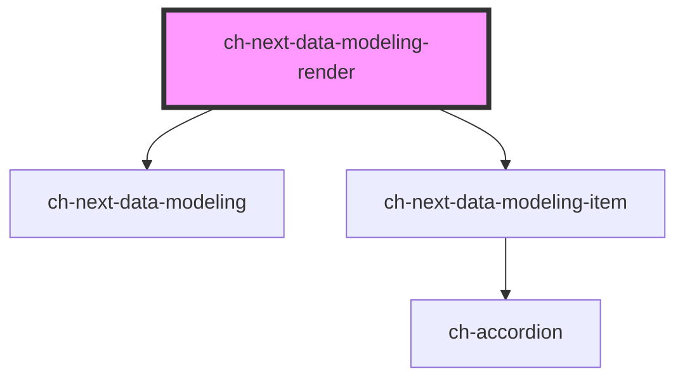

# ch-next-data-modeling-render

<!-- Auto Generated Below -->

## Properties

| Property                     | Attribute                     | Description                                                                                                                                                                                                      | Type                                                                                                                                                                                                                                                                                        | Default                                                                                                                                                                                                                                                                                                                                                                                                                                          |
| ---------------------------- | ----------------------------- | ---------------------------------------------------------------------------------------------------------------------------------------------------------------------------------------------------------------- | ------------------------------------------------------------------------------------------------------------------------------------------------------------------------------------------------------------------------------------------------------------------------------------------- | ------------------------------------------------------------------------------------------------------------------------------------------------------------------------------------------------------------------------------------------------------------------------------------------------------------------------------------------------------------------------------------------------------------------------------------------------ |
| `addingModeCommonClass`      | `adding-mode-common-class`    | A CSS class to set as the `ch-next-data-modeling-item` element class when adding mode is enabled.                                                                                                                | `string`                                                                                                                                                                                                                                                                                    | `undefined`                                                                                                                                                                                                                                                                                                                                                                                                                                      |
| `captions`                   | --                            | The labels used in the buttons of the items. Important for accessibility.                                                                                                                                        | `{ cancel: string; delete: string; ATT: string; ENTITY: string; LEVEL: string; editing: string; adding: string; addNewEntity: string; addNewField: string; collection: string; confirm: string; edit: string; deleting: string; deleteMode: string; newEntity: string; newField: string; }` | `{     ATT: "Attribute",     ENTITY: "Entity",     LEVEL: "Collection",     adding: "Adding...",     addNewEntity: "Add new entity",     addNewField: "Add new field",     cancel: "Cancel",     collection: "Collection",     confirm: "Confirm",     delete: "Delete",     deleteMode: "Confirm delete?",     deleting: "Deleting...",     edit: "Edit",     editing: "Saving...",     newEntity: "New Entity",     newField: "New Field"   }` |
| `commonClass`                | `common-class`                | A CSS class to set as the `ch-next-data-modeling-item` element class.                                                                                                                                            | `string`                                                                                                                                                                                                                                                                                    | `undefined`                                                                                                                                                                                                                                                                                                                                                                                                                                      |
| `createGxCollectionCallback` | --                            | This callback is used to created a new SDT GxCollectionField based on the EntityItem type.                                                                                                                       | `() => EntityItem[]`                                                                                                                                                                                                                                                                        | `undefined`                                                                                                                                                                                                                                                                                                                                                                                                                                      |
| `cssClass`                   | `css-class`                   | A CSS class to set as the `ch-next-data-modeling` element class.                                                                                                                                                 | `string`                                                                                                                                                                                                                                                                                    | `undefined`                                                                                                                                                                                                                                                                                                                                                                                                                                      |
| `dataModel`                  | --                            | This property represents the UI model that is currently rendered.                                                                                                                                                | `{ Entities: Entity[]; }`                                                                                                                                                                                                                                                                   | `undefined`                                                                                                                                                                                                                                                                                                                                                                                                                                      |
| `dataModelToEdit`            | --                            | This property represents a copy of the UI model that is currently rendered. Useful for making changes that may or may not be accepted by the server.                                                             | `{ Entities: Entity[]; }`                                                                                                                                                                                                                                                                   | `undefined`                                                                                                                                                                                                                                                                                                                                                                                                                                      |
| `disabled`                   | `disabled`                    | This attribute lets you specify if the element is disabled. If disabled, it will not fire any user interaction related event.                                                                                    | `boolean`                                                                                                                                                                                                                                                                                   | `false`                                                                                                                                                                                                                                                                                                                                                                                                                                          |
| `entityAddingModeClass`      | `entity-adding-mode-class`    | A CSS class to set as the `ch-next-data-modeling-item` element class with `level === "0"` and `mode === "add"`.                                                                                                  | `string`                                                                                                                                                                                                                                                                                    | `undefined`                                                                                                                                                                                                                                                                                                                                                                                                                                      |
| `entityClass`                | `entity-class`                | A CSS class to set as the `ch-next-data-modeling-item` element class with `level === "0"` and `mode !== "add"`.                                                                                                  | `string`                                                                                                                                                                                                                                                                                    | `undefined`                                                                                                                                                                                                                                                                                                                                                                                                                                      |
| `errorTexts`                 | --                            | The error texts used for the new field input.                                                                                                                                                                    | `{ Empty: string; AlreadyDefined1: string; AlreadyDefinedEntity1: string; AlreadyDefined2: string; }`                                                                                                                                                                                       | `{     Empty: "Field is empty.",     AlreadyDefined1: "Field ",     AlreadyDefinedEntity1: "Entity ",     AlreadyDefined2: " already exists."   }`                                                                                                                                                                                                                                                                                               |
| `fieldAddingModeClass`       | `field-adding-mode-class`     | A CSS class to set as the `ch-next-data-modeling-item` element class with `level === "0" \| "1"` and `mode === "add"`.                                                                                           | `string`                                                                                                                                                                                                                                                                                    | `undefined`                                                                                                                                                                                                                                                                                                                                                                                                                                      |
| `fieldClass`                 | `field-class`                 | A CSS class to set as the `ch-next-data-modeling-item` element class with `level === "1"` and `mode !== "add"`.                                                                                                  | `string`                                                                                                                                                                                                                                                                                    | `undefined`                                                                                                                                                                                                                                                                                                                                                                                                                                      |
| `fieldCommonClass`           | `field-common-class`          | A CSS class to set as the `ch-next-data-modeling-item` element class with (`level === "0"` and `mode !== "add"`) or `level === "1" \| "2"`.                                                                      | `string`                                                                                                                                                                                                                                                                                    | `undefined`                                                                                                                                                                                                                                                                                                                                                                                                                                      |
| `fieldContainerClass`        | `field-container-class`       | A CSS class to set as the `ch-next-data-modeling` element class with `level === "1"`.                                                                                                                            | `string`                                                                                                                                                                                                                                                                                    | `undefined`                                                                                                                                                                                                                                                                                                                                                                                                                                      |
| `hideLoading`                | `hide-loading`                | This property is a WA due to Angular's bug not letting execute UC 2.0 methods on different layouts.                                                                                                              | `any`                                                                                                                                                                                                                                                                                       | `null`                                                                                                                                                                                                                                                                                                                                                                                                                                           |
| `maxAtts`                    | `max-atts`                    | Determine the maximum amount of ATTs displayed per entity.                                                                                                                                                       | `number`                                                                                                                                                                                                                                                                                    | `3`                                                                                                                                                                                                                                                                                                                                                                                                                                              |
| `readonly`                   | `readonly`                    | This attribute indicates that the user cannot modify the value of the control. Same as [readonly](https://developer.mozilla.org/en-US/docs/Web/HTML/Element/input#attr-readonly) attribute for `input` elements. | `boolean`                                                                                                                                                                                                                                                                                   | `false`                                                                                                                                                                                                                                                                                                                                                                                                                                          |
| `subFieldAddingModeClass`    | `sub-field-adding-mode-class` | A CSS class to set as the `ch-next-data-modeling-item` element class with `level = "2"` and `mode === "add"`.                                                                                                    | `string`                                                                                                                                                                                                                                                                                    | `undefined`                                                                                                                                                                                                                                                                                                                                                                                                                                      |
| `subFieldClass`              | `sub-field-class`             | A CSS class to set as the `ch-next-data-modeling-item` element class with `level = "2"` and `mode !== "add"`.                                                                                                    | `string`                                                                                                                                                                                                                                                                                    | `undefined`                                                                                                                                                                                                                                                                                                                                                                                                                                      |
| `subFieldContainerClass`     | `sub-field-container-class`   | A CSS class to set as the `ch-next-data-modeling` element class with `level === "2"`.                                                                                                                            | `string`                                                                                                                                                                                                                                                                                    | `undefined`                                                                                                                                                                                                                                                                                                                                                                                                                                      |

## Events

| Event          | Description                                  | Type               |
| -------------- | -------------------------------------------- | ------------------ |
| `fieldAdded`   | Emitted when a new field is added or edited. | `CustomEvent<any>` |
| `fieldRemoved` | Emitted when a new field is removed.         | `CustomEvent<any>` |

## Dependencies

### Depends on

- [ch-next-data-modeling](../data-modeling)
- [ch-next-data-modeling-item](../data-modeling-item)

### Graph

----------------------------------------------

*Built with [StencilJS](https://stenciljs.com/)*
