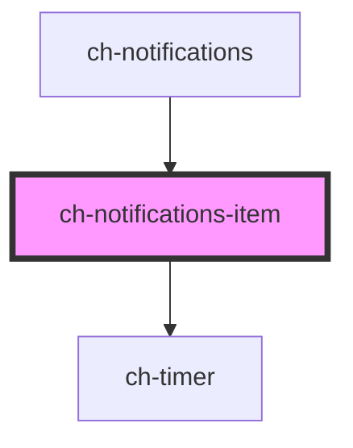

# ch-notifications-item

<!-- Auto Generated Below -->

## Properties

| Property                    | Attribute                      | Description                                                                                                                                                                  | Type      | Default               |
| --------------------------- | ------------------------------ | ---------------------------------------------------------------------------------------------------------------------------------------------------------------------------- | --------- | --------------------- |
| `closeButtonAccessibleName` | `close-button-accessible-name` | Determine the accessible name of the close button. Important for accessibility.                                                                                              | `string`  | `"Close"`             |
| `countdown`                 | `countdown`                    | Countdown which initial state is dismissTimeout ms.                                                                                                                          | `number`  | `this.dismissTimeout` |
| `dismissTimeout`            | `dismiss-timeout`              | Specifies the time (ms) for the alert to be displayed. if `dismissTimeout = 0`, the alert will be always visible (unless is dismissed by the closeButton).                   | `0`       | `0`                   |
| `leftImgSrc`                | `left-img-src`                 | Determine src of the left image.                                                                                                                                             | `""`      | `""`                  |
| `pauseOnHover`              | `pause-on-hover`               | Toggles the Pause on Hover functionality                                                                                                                                     | `boolean` | `true`                |
| `showCloseButton`           | `show-close-button`            | Determine if the closeButton is displayed or not.                                                                                                                            | `boolean` | `false`               |
| `showTimeoutBar`            | `show-timeout-bar`             | If dismissTimeout > 0, a progress bar is displayed at the bottom of the element showing the time left for the alert to show. The progress stops when the element is hovered. | `boolean` | `false`               |
| `timerInterval`             | `timer-interval`               | Sets the desired interval                                                                                                                                                    | `50`      | `50`                  |

## Events

| Event                 | Description                   | Type                  |
| --------------------- | ----------------------------- | --------------------- |
| `notificationClick`   | the notificationClick event   | `CustomEvent<number>` |
| `notificationDismiss` | the notificationDismiss event | `CustomEvent<number>` |

## Shadow Parts

| Part                    | Description |
| ----------------------- | ----------- |
| `"close-button"`        |             |
| `"content"`             |             |
| `"image"`               |             |
| `"indicator-container"` |             |

## Dependencies

### Used by

 - [ch-notifications](../notifications)

### Depends on

- [ch-timer](../timer)

### Graph

----------------------------------------------

*Built with [StencilJS](https://stenciljs.com/)*
