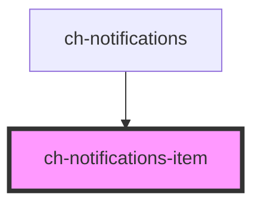

# ch-notifications-item

<!-- Auto Generated Below -->

## Properties

| Property           | Attribute            | Description                                  | Type      | Default     |
| ------------------ | -------------------- | -------------------------------------------- | --------- | ----------- |
| `buttonImgSrc`     | `button-img-src`     |                                              | `string`  | `undefined` |
| `closeButtonLabel` | `close-button-label` |                                              | `string`  | `undefined` |
| `leftImgSrc`       | `left-img-src`       |                                              | `string`  | `undefined` |
| `showCloseButton`  | `show-close-button`  | `true` to show the close notification button | `boolean` | `true`      |
| `timeToDismiss`    | `time-to-dismiss`    |                                              | `5000`    | `5000`      |

## Events

| Event                 | Description | Type                  |
| --------------------- | ----------- | --------------------- |
| `notificationClick`   |             | `CustomEvent<number>` |
| `notificationDismiss` |             | `CustomEvent<number>` |

## Dependencies

### Used by

 - [ch-notifications](../notifications)

### Graph

----------------------------------------------

*Built with [StencilJS](https://stenciljs.com/)*
