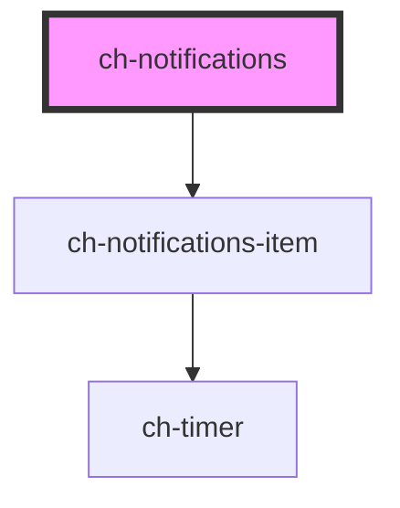

# ch-notifications

<!-- Auto Generated Below -->

## Properties

| Property                         | Attribute                            | Description | Type                                                                                            | Default           |
| -------------------------------- | ------------------------------------ | ----------- | ----------------------------------------------------------------------------------------------- | ----------------- |
| `delayToAnimateNewNotifications` | `delay-to-animate-new-notifications` |             | `number`                                                                                        | `50`              |
| `notifications`                  | --                                   |             | `NotificationMessageWithDelay[]`                                                                | `[]`              |
| `position`                       | `position`                           |             | `"bottom-center" \| "bottom-end" \| "bottom-start" \| "top-center" \| "top-end" \| "top-start"` | `"bottom-center"` |
| `timeToDismissNotifications`     | `time-to-dismiss-notifications`      |             | `number`                                                                                        | `5000`            |
| `timeType`                       | `time-type`                          |             | `"Milliseconds" \| "Seconds"`                                                                   | `"Milliseconds"`  |

## Dependencies

### Depends on

- [ch-notifications-item](../notifications-item)

### Graph

----------------------------------------------

*Built with [StencilJS](https://stenciljs.com/)*
