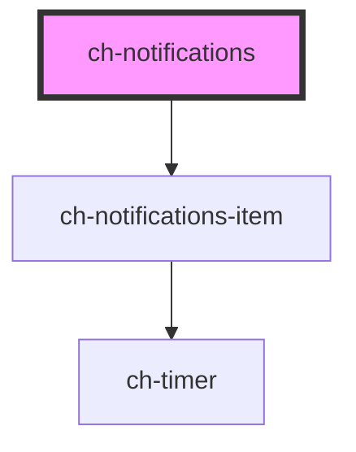

# ch-notifications

<!-- Auto Generated Below -->

## Properties

| Property                         | Attribute                            | Description                                                                                               | Type                                                                                                                                                               | Default               |
| -------------------------------- | ------------------------------------ | --------------------------------------------------------------------------------------------------------- | ------------------------------------------------------------------------------------------------------------------------------------------------------------------ | --------------------- |
| `delayToAnimateNewNotifications` | `delay-to-animate-new-notifications` | Delay to animate new notifications                                                                        | `number`                                                                                                                                                           | `50`                  |
| `notifications`                  | --                                   | The notifications prop                                                                                    | `NotificationMessageWithDelay[]`                                                                                                                                   | `[]`                  |
| `position`                       | `position`                           | /**   Specifies the position of the whole notifications section    that is placed relative to the window. | `"Center_OutsideEnd" \| "Center_OutsideStart" \| "OutsideEnd_OutsideEnd" \| "OutsideEnd_OutsideStart" \| "OutsideStart_OutsideEnd" \| "OutsideStart_OutsideStart"` | `"Center_OutsideEnd"` |
| `timeToDismissNotifications`     | `time-to-dismiss-notifications`      | The default dismiss timeout as group if not set for each notification individually                        | `number`                                                                                                                                                           | `5000`                |
| `timeType`                       | `time-type`                          | Time type only applies for timeToDismissNotifications, not for individual dismissTimeout                  | `"Milliseconds" \| "Seconds"`                                                                                                                                      | `"Milliseconds"`      |

## Dependencies

### Depends on

- [ch-notifications-item](../notifications-item)

### Graph

----------------------------------------------

*Built with [StencilJS](https://stenciljs.com/)*
