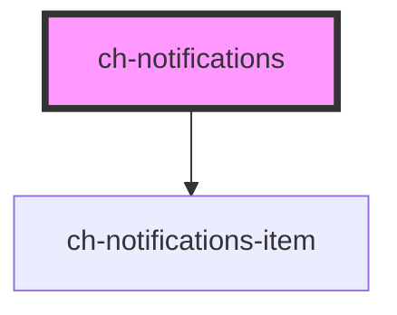

# ch-notifications

<!-- Auto Generated Below -->

## Properties

| Property                         | Attribute                            | Description                                                     | Type                             | Default          |
| -------------------------------- | ------------------------------------ | --------------------------------------------------------------- | -------------------------------- | ---------------- |
| `cssClass`                       | `css-class`                          | A CSS class to set as the `ch-next-progress-bar` element class. | `string`                         | `undefined`      |
| `delayToAnimateNewNotifications` | `delay-to-animate-new-notifications` |                                                                 | `number`                         | `50`             |
| `notifications`                  | `notifications`                      |                                                                 | `string`                         | `undefined`      |
| `position`                       | `position`                           |                                                                 | `"bottom-end" \| "bottom-start"` | `"bottom-end"`   |
| `timeToDismissNotifications`     | `time-to-dismiss-notifications`      |                                                                 | `number`                         | `5000`           |
| `timeType`                       | `time-type`                          |                                                                 | `"milliseconds" \| "seconds"`    | `"milliseconds"` |

## Dependencies

### Depends on

- [ch-notifications-item](../notifications-item)

### Graph

----------------------------------------------

*Built with [StencilJS](https://stenciljs.com/)*
