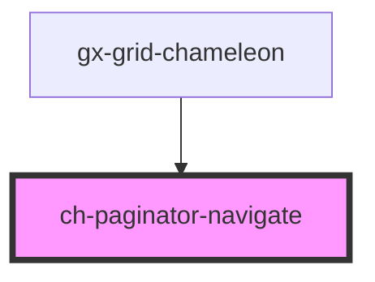

# ch-paginator-navigate

<!-- Auto Generated Below -->

## Properties

| Property   | Attribute  | Description | Type                                                                                                                                        | Default     |
| ---------- | ---------- | ----------- | ------------------------------------------------------------------------------------------------------------------------------------------- | ----------- |
| `disabled` | `disabled` |             | `boolean`                                                                                                                                   | `undefined` |
| `type`     | `type`     |             | `ChPaginatorNavigationType.FIRST \| ChPaginatorNavigationType.LAST \| ChPaginatorNavigationType.NEXT \| ChPaginatorNavigationType.PREVIOUS` | `undefined` |

## Events

| Event               | Description | Type                                             |
| ------------------- | ----------- | ------------------------------------------------ |
| `navigationClicked` |             | `CustomEvent<ChPaginatorNavigationClickedEvent>` |

## Dependencies

### Used by

 - [gx-grid-chameleon](../gx-grid)

### Graph

----------------------------------------------

*Built with [StencilJS](https://stenciljs.com/)*
