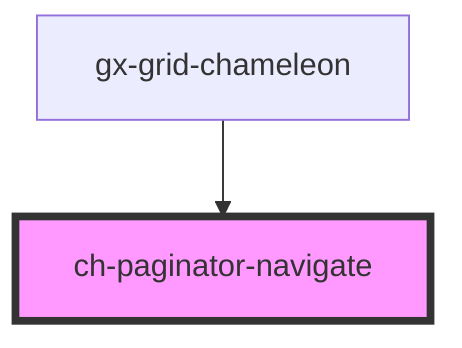

# ch-paginator-navigate

<!-- Auto Generated Below -->

## Properties

| Property   | Attribute  | Description                                | Type                                        | Default     |
| ---------- | ---------- | ------------------------------------------ | ------------------------------------------- | ----------- |
| `disabled` | `disabled` | Flag indicating if the button is disabled. | `boolean`                                   | `undefined` |
| `type`     | `type`     | The type of navigation button.             | `"first" \| "last" \| "next" \| "previous"` | `undefined` |

## Events

| Event             | Description                                          | Type                                           |
| ----------------- | ---------------------------------------------------- | ---------------------------------------------- |
| `navigateClicked` | Event emitted when the navigation button is pressed. | `CustomEvent<ChPaginatorNavigateClickedEvent>` |

## Dependencies

### Used by

 - [gx-grid-chameleon](../../gx-grid)

### Graph

----------------------------------------------

*Built with [StencilJS](https://stenciljs.com/)*
