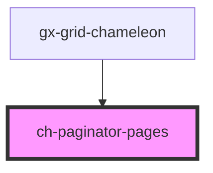

# ch-paginator-pages

<!-- Auto Generated Below -->

## Properties

| Property               | Attribute                 | Description                                               | Type      | Default |
| ---------------------- | ------------------------- | --------------------------------------------------------- | --------- | ------- |
| `maxSize`              | `max-size`                | The maximum number of items to display in the pagination. | `number`  | `9`     |
| `page`                 | `page`                    | The active page number.                                   | `number`  | `1`     |
| `renderFirstLastPages` | `render-first-last-pages` | Flag to render the first and last pages.                  | `boolean` | `true`  |
| `textDots`             | `text-dots`               | The text to display for the dots.                         | `string`  | `"..."` |
| `totalPages`           | `total-pages`             | The total number of pages.                                | `1`       | `1`     |

## Events

| Event         | Description                          | Type                                            |
| ------------- | ------------------------------------ | ----------------------------------------------- |
| `pageChanged` | Event emitted when the page changes. | `CustomEvent<ChPaginatorPagesPageChangedEvent>` |

## Shadow Parts

| Part       | Description |
| ---------- | ----------- |
| `"button"` |             |
| `"dots"`   |             |
| `"page"`   |             |
| `"pages"`  |             |

## Dependencies

### Used by

 - [gx-grid-chameleon](../../gx-grid)

### Graph

----------------------------------------------

*Built with [StencilJS](https://stenciljs.com/)*
