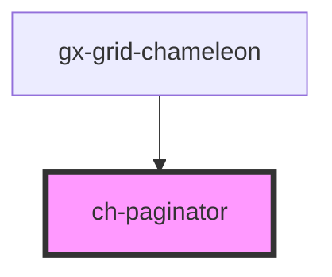

# ch-grid-footer

<!-- Auto Generated Below -->

## Properties

| Property               | Attribute                 | Description | Type      | Default      |
| ---------------------- | ------------------------- | ----------- | --------- | ------------ |
| `activePage`           | `active-page`             |             | `number`  | `1`          |
| `maxSize`              | `max-size`                |             | `number`  | `9`          |
| `renderButtonFirst`    | `render-button-first`     |             | `boolean` | `true`       |
| `renderButtonLast`     | `render-button-last`      |             | `boolean` | `true`       |
| `renderButtonNext`     | `render-button-next`      |             | `boolean` | `true`       |
| `renderButtonPrevious` | `render-button-previous`  |             | `boolean` | `true`       |
| `renderFirstLastPages` | `render-first-last-pages` |             | `boolean` | `true`       |
| `textDots`             | `text-dots`               |             | `string`  | `"..."`      |
| `textFirst`            | `text-first`              |             | `string`  | `"First"`    |
| `textLast`             | `text-last`               |             | `string`  | `"Last"`     |
| `textNext`             | `text-next`               |             | `string`  | `"Next"`     |
| `textPrevious`         | `text-previous`           |             | `string`  | `"Previous"` |
| `totalPages`           | `total-pages`             |             | `number`  | `1`          |

## Events

| Event                     | Description | Type                                                    |
| ------------------------- | ----------- | ------------------------------------------------------- |
| `activePageChanged`       |             | `CustomEvent<ChPaginatorActivePageChangedEvent>`        |
| `navigationButtonClicked` |             | `CustomEvent<ChPaginatorNavigationButtonClieckedEvent>` |

## Dependencies

### Used by

- [gx-grid-chameleon](../gx-grid)

### Graph

---

_Built with [StencilJS](https://stenciljs.com/)_
