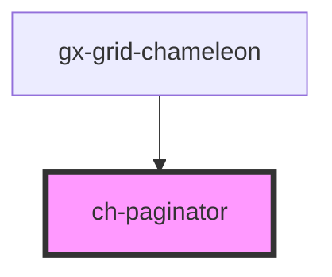

# ch-grid-footer

<!-- Auto Generated Below -->

## Events

| Event               | Description | Type                                             |
| ------------------- | ----------- | ------------------------------------------------ |
| `activePageChanged` |             | `CustomEvent<ChPaginatorActivePageChangedEvent>` |

## Dependencies

### Used by

- [gx-grid-chameleon](../gx-grid)

### Graph

---

_Built with [StencilJS](https://stenciljs.com/)_
