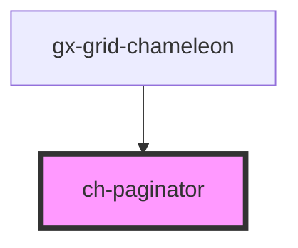

# ch-grid-footer

<!-- Auto Generated Below -->

## Overview

The 'ch-paginator' component represents a paginator control for navigating through pages.

## Properties

| Property      | Attribute       | Description                                                                                                          | Type      | Default |
| ------------- | --------------- | -------------------------------------------------------------------------------------------------------------------- | --------- | ------- |
| `activePage`  | `active-page`   | The active page number.                                                                                              | `number`  | `1`     |
| `hasNextPage` | `has-next-page` | Indicates that the end has been reached. Use when total pages are not known (totalPages = -1).                       | `boolean` | `false` |
| `totalPages`  | `total-pages`   | The total number of pages. Use -1 if not known and 'hasNextPage' property to indicate that the end has been reached. | `1`       | `1`     |

## Events

| Event                     | Description                                     | Type                                                   |
| ------------------------- | ----------------------------------------------- | ------------------------------------------------------ |
| `activePageChanged`       | Event emitted when the active page changes.     | `CustomEvent<ChPaginatorActivePageChangedEvent>`       |
| `pageNavigationRequested` | Event emitted when the navigation is requested. | `CustomEvent<ChPaginatorPageNavigationRequestedEvent>` |

## Dependencies

### Used by

 - [gx-grid-chameleon](../gx-grid)

### Graph

----------------------------------------------

*Built with [StencilJS](https://stenciljs.com/)*
