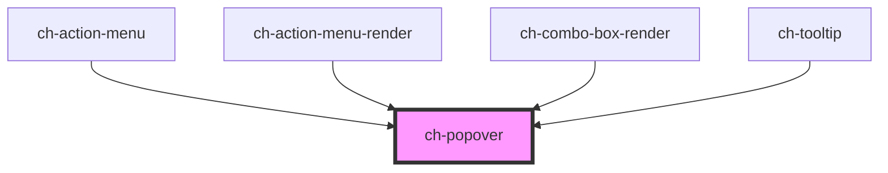

# ch-popover

<!-- Auto Generated Below -->

## Overview

The `ch-popover` component represents a popover container that is positioned
relative to an element, but placed on the top layer using `position: fixed`.

## Properties

| Property              | Attribute                | Description                                                                                                                                                                                                                                                                                                                                                                                                                                                                                | Type                                                                             | Default      |
| --------------------- | ------------------------ | ------------------------------------------------------------------------------------------------------------------------------------------------------------------------------------------------------------------------------------------------------------------------------------------------------------------------------------------------------------------------------------------------------------------------------------------------------------------------------------------ | -------------------------------------------------------------------------------- | ------------ |
| `actionById`          | `action-by-id`           | `true` if the `actionElement` binds the ch-popover using an external ID. If so, the `popoverTargetElement` property won't be configured in the action element.                                                                                                                                                                                                                                                                                                                             | `boolean`                                                                        | `false`      |
| `actionElement`       | --                       | Specifies a reference of the action that controls the popover control.                                                                                                                                                                                                                                                                                                                                                                                                                     | `HTMLButtonElement \| HTMLInputElement`                                          | `undefined`  |
| `allowDrag`           | `allow-drag`             | Specifies the drag behavior of the popover. If `allowDrag === "header"`, a slot with the `"header"` name will be available to place the header content.                                                                                                                                                                                                                                                                                                                                    | `"box" \| "header" \| "no"`                                                      | `"no"`       |
| `blockAlign`          | `block-align`            | Specifies the block alignment of the window.                                                                                                                                                                                                                                                                                                                                                                                                                                               | `"center" \| "inside-end" \| "inside-start" \| "outside-end" \| "outside-start"` | `"center"`   |
| `blockSizeMatch`      | `block-size-match`       | Specifies how the popover adapts its block size.  - "content": The block size of the control will be determined by its    content block size.  - "action-element": The block size of the control will match the block    size of the `actionElement`.  - "action-element-as-minimum": The minimum block size of the control    will match the block size of the `actionElement`.  If the control is resized at runtime, only the "action-element-as-minimum" value will still work.        | `"action-element" \| "action-element-as-minimum" \| "content"`                   | `"content"`  |
| `closeOnClickOutside` | `close-on-click-outside` | This property only applies for `"manual"` mode. In native popovers, when using `"manual"` mode the popover doesn't close when clicking outside the control. This property allows to close the popover when clicking outside in `"manual"` mode. With this, the popover will close if the click is triggered on any other element than the popover and the `actionElement`. It will also close if the "Escape" key is pressed.                                                              | `boolean`                                                                        | `false`      |
| `firstLayer`          | `first-layer`            | `true` if the control is not stacked with another top layer.                                                                                                                                                                                                                                                                                                                                                                                                                               | `boolean`                                                                        | `true`       |
| `inlineAlign`         | `inline-align`           | Specifies the inline alignment of the window.                                                                                                                                                                                                                                                                                                                                                                                                                                              | `"center" \| "inside-end" \| "inside-start" \| "outside-end" \| "outside-start"` | `"center"`   |
| `inlineSizeMatch`     | `inline-size-match`      | Specifies how the popover adapts its inline size.  - "content": The inline size of the control will be determined by its    content inline size.  - "action-element": The inline size of the control will match the inline    size of the `actionElement`.  - "action-element-as-minimum": The minimum inline size of the control    will match the inline size of the `actionElement`.  If the control is resized at runtime, only the "action-element-as-minimum" value will still work. | `"action-element" \| "action-element-as-minimum" \| "content"`                   | `"content"`  |
| `mode`                | `popover`                | Popovers that have the `"auto"` state can be "light dismissed" by selecting outside the popover area, and generally only allow one popover to be displayed on-screen at a time. By contrast, `"manual"` popovers must always be explicitly hidden, but allow for use cases such as nested popovers in menus.                                                                                                                                                                               | `"auto" \| "manual"`                                                             | `"auto"`     |
| `overflowBehavior`    | `overflow-behavior`      | Specifies how the popover behaves when the content overflows the window size.   - "overflow": The control won't implement any behavior if the content overflows.   - "add-scroll": The control will place a scroll if the content overflows.                                                                                                                                                                                                                                               | `"add-scroll" \| "overflow"`                                                     | `"overflow"` |
| `positionTry`         | `position-try`           | Specifies an alternative position to try when the control overflows the window.                                                                                                                                                                                                                                                                                                                                                                                                            | `"flip-block" \| "flip-inline" \| "none"`                                        | `"none"`     |
| `resizable`           | `resizable`              | Specifies whether the control can be resized. If `true` the control can be resized at runtime by dragging the edges or corners.                                                                                                                                                                                                                                                                                                                                                            | `boolean`                                                                        | `false`      |
| `show`                | `show`                   | Specifies whether the popover is hidden or visible.                                                                                                                                                                                                                                                                                                                                                                                                                                        | `boolean`                                                                        | `false`      |

## Events

| Event           | Description                                                                                                                                            | Type               |
| --------------- | ------------------------------------------------------------------------------------------------------------------------------------------------------ | ------------------ |
| `popoverClosed` | Emitted when the popover is closed by an user interaction.  This event can be prevented (`preventDefault()`), interrupting the `ch-popover`'s closing. | `CustomEvent<any>` |
| `popoverOpened` | Emitted when the popover is opened by an user interaction.  This event can be prevented (`preventDefault()`), interrupting the ch-popover's opening.   | `CustomEvent<any>` |

## Shadow Parts

| Part       | Description |
| ---------- | ----------- |
| `"header"` |             |

## CSS Custom Properties

| Name                            | Description                                                                                                          |
| ------------------------------- | -------------------------------------------------------------------------------------------------------------------- |
| `--ch-popover-block-size`       | Specifies the block size of the popover. Useful for scenarios where the popover is resizable. @default max-content   |
| `--ch-popover-inline-size`      | Specifies the inline size of the popover. Useful for scenarios where the popover is resizable. @default max-content  |
| `--ch-popover-max-block-size`   | Specifies the maximum block size of the popover. Useful for scenarios where the popover is resizable. @default auto  |
| `--ch-popover-max-inline-size`  | Specifies the maximum inline size of the popover. Useful for scenarios where the popover is resizable. @default auto |
| `--ch-popover-min-block-size`   | Specifies the minimum block size of the popover. Useful for scenarios where the popover is resizable. @default auto  |
| `--ch-popover-min-inline-size`  | Specifies the minimum inline size of the popover. Useful for scenarios where the popover is resizable. @default auto |
| `--ch-popover-resize-threshold` | Specifies the size of the threshold to resize the popover. @default 4px                                              |
| `--ch-popover-separation-x`     | Specifies the separation between the action and popover in the x axis. @default 0px                                  |
| `--ch-popover-separation-y`     | Specifies the separation between the action and popover in the y axis. @default 0px                                  |

## Dependencies

### Used by

 - [ch-action-menu](../action-menu/internal/action-menu)
 - [ch-action-menu-render](../action-menu)
 - [ch-combo-box-render](../combo-box)
 - [ch-tooltip](../tooltip)

### Graph

----------------------------------------------

*Built with [StencilJS](https://stenciljs.com/)*
