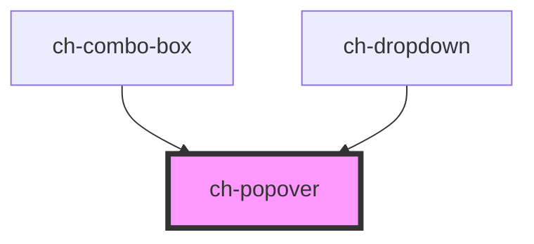

# ch-popover

<!-- Auto Generated Below -->

## Overview

The `ch-popover` component represents a popover container that is positioned
relative to an element, but placed on the top layer using `position: fixed`.

## Properties

| Property              | Attribute              | Description                                                                                                                                                                                                                                                                                                  | Type                                                                             | Default     |
| --------------------- | ---------------------- | ------------------------------------------------------------------------------------------------------------------------------------------------------------------------------------------------------------------------------------------------------------------------------------------------------------ | -------------------------------------------------------------------------------- | ----------- |
| `actionById`          | `action-by-id`         | `true` if the `actionElement` binds the ch-popover using an external ID. If so, the `popoverTargetElement` property won't be configured in the action element.                                                                                                                                               | `boolean`                                                                        | `false`     |
| `actionElement`       | --                     | Specifies a reference of the action that controls the popover control.                                                                                                                                                                                                                                       | `HTMLButtonElement \| HTMLInputElement`                                          | `undefined` |
| `allowDrag`           | `allow-drag`           | Specifies the drag behavior of the popover. If `allowDrag === "header"`, a slot with the `"header"` name will be available to place the header content.                                                                                                                                                      | `"box" \| "header" \| "no"`                                                      | `"no"`      |
| `blockAlign`          | `block-align`          | Specifies the block alignment of the window.                                                                                                                                                                                                                                                                 | `"center" \| "inside-end" \| "inside-start" \| "outside-end" \| "outside-start"` | `"center"`  |
| `firstLayer`          | `first-layer`          | `true` if the control is not stacked with another top layer.                                                                                                                                                                                                                                                 | `boolean`                                                                        | `true`      |
| `hidden`              | `hidden`               | Specifies whether the popover is hidden or visible.                                                                                                                                                                                                                                                          | `boolean`                                                                        | `true`      |
| `inlineAlign`         | `inline-align`         | Specifies the inline alignment of the window.                                                                                                                                                                                                                                                                | `"center" \| "inside-end" \| "inside-start" \| "outside-end" \| "outside-start"` | `"center"`  |
| `mode`                | `mode`                 | Popovers that have the `"auto"` state can be "light dismissed" by selecting outside the popover area, and generally only allow one popover to be displayed on-screen at a time. By contrast, `"manual"` popovers must always be explicitly hidden, but allow for use cases such as nested popovers in menus. | `"auto" \| "manual"`                                                             | `"auto"`    |
| `resizable`           | `resizable`            | Specifies whether the control can be resized. If `true` the control can be resized at runtime by dragging the edges or corners.                                                                                                                                                                              | `boolean`                                                                        | `false`     |
| `responsiveAlignment` | `responsive-alignment` | Specifies if the popover is automatically aligned is the content overflow the window.                                                                                                                                                                                                                        | `boolean`                                                                        | `true`      |

## Events

| Event           | Description                         | Type               |
| --------------- | ----------------------------------- | ------------------ |
| `popoverClosed` | Emitted when the popover is closed. | `CustomEvent<any>` |
| `popoverOpened` | Emitted when the popover is opened. | `CustomEvent<any>` |

## Shadow Parts

| Part       | Description |
| ---------- | ----------- |
| `"header"` |             |

## CSS Custom Properties

| Name                            | Description                                                                                                          |
| ------------------------------- | -------------------------------------------------------------------------------------------------------------------- |
| `--ch-popover-block-size`       | Specifies the block size of the popover. Useful for scenarios where the popover is resizable. @default max-content   |
| `--ch-popover-inline-size`      | Specifies the inline size of the popover. Useful for scenarios where the popover is resizable. @default max-content  |
| `--ch-popover-max-block-size`   | Specifies the maximum block size of the popover. Useful for scenarios where the popover is resizable. @default auto  |
| `--ch-popover-max-inline-size`  | Specifies the maximum inline size of the popover. Useful for scenarios where the popover is resizable. @default auto |
| `--ch-popover-min-block-size`   | Specifies the minimum block size of the popover. Useful for scenarios where the popover is resizable. @default auto  |
| `--ch-popover-min-inline-size`  | Specifies the minimum inline size of the popover. Useful for scenarios where the popover is resizable. @default auto |
| `--ch-popover-resize-threshold` | Specifies the size of the threshold to resize the popover. @default 4px                                              |
| `--ch-popover-separation-x`     | Specifies the separation between the action and popover in the x axis. @default 0px                                  |
| `--ch-popover-separation-y`     | Specifies the separation between the action and popover in the y axis. @default 0px                                  |

## Dependencies

### Used by

 - [ch-combo-box](../combobox)
 - [ch-dropdown](../dropdown)

### Graph

----------------------------------------------

*Built with [StencilJS](https://stenciljs.com/)*
