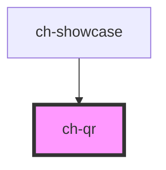

# ch-qr

<!-- Auto Generated Below -->

## Properties

| Property               | Attribute                | Description                                                                                                                                                                                                                                                          | Type                       | Default     |
| ---------------------- | ------------------------ | -------------------------------------------------------------------------------------------------------------------------------------------------------------------------------------------------------------------------------------------------------------------- | -------------------------- | ----------- |
| `accessibleName`       | `accessible-name`        | Specifies a short string, typically 1 to 3 words, that authors associate with an element to provide users of assistive technologies with a label for the element.                                                                                                    | `string`                   | `undefined` |
| `background`           | `background`             | The background color of the render QR. If not specified, "transparent" will be used.                                                                                                                                                                                 | `string`                   | `null`      |
| `errorCorrectionLevel` | `error-correction-level` | The four values L, M, Q, and H will use %7, 15%, 25%, and 30% of the QR code for error correction respectively. So on one hand the code will get bigger but chances are also higher that it will be read without errors later on. This value is by default High (H). | `"H" \| "L" \| "M" \| "Q"` | `"H"`       |
| `fill`                 | `fill`                   | What color you want your QR code to be.                                                                                                                                                                                                                              | `string`                   | `"black"`   |
| `radius`               | `radius`                 | Defines how round the blocks should be. Numbers from 0 (squares) to 0.5 (maximum round) are supported.                                                                                                                                                               | `number`                   | `0`         |
| `size`                 | `size`                   | The total size of the final QR code in pixels.                                                                                                                                                                                                                       | `number`                   | `128`       |
| `value`                | `value`                  | Any kind of text, also links, email addresses, any thing.                                                                                                                                                                                                            | `string`                   | `undefined` |

## Dependencies

### Used by

 - [ch-showcase](../../showcase/assets/components)

### Graph

----------------------------------------------

*Built with [StencilJS](https://stenciljs.com/)*
