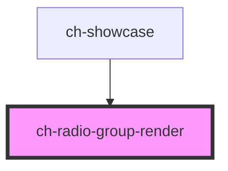

# ch-radio-group-render

## Table of Contents

- [Overview](#overview)
- [Features](#features)
- [Use when](#use-when)
- [Do not use when](#do-not-use-when)
- [Slots](#slots)
- [Accessibility](#accessibility)
- [Usage](./docs/usage.md)
- [Properties](#properties)
- [Events](#events)
- [Dependencies](#dependencies)
  - [Used by](#used-by)
  - [Graph](#graph)
- [Styling](./docs/styling.md)

<!-- Auto Generated Below -->

## Overview

The `ch-radio-group-render` component renders a group of mutually exclusive radio options, allowing users to select exactly one value from a short list.

## Features
 - Mutually exclusive selection from a set of options.
 - Horizontal or vertical layout via the `direction` property.
 - Individual item disabling.
 - Accessible labels for each option.
 - Form-associated via `ElementInternals`.

## Use when
 - A small, static set of options where all choices should be visible at once.
 - Exactly one option must be selected from the group.
 - The user must choose exactly one option from 2–7 mutually exclusive choices.
 - All options should be visible simultaneously so users can compare before deciding.
 - The choice is part of a form that requires a submit step.

## Do not use when
 - The option list is long or searchable — prefer `ch-combo-box-render` instead.
 - Multiple options can be selected — prefer `ch-checkbox` instead.
 - More than 7–8 options are available — prefer `ch-combo-box-render`.
 - The setting takes immediate effect — prefer `ch-switch`.
 - A single radio button is used in isolation — radio inputs must always work as a group and cannot be unchecked once selected.

## Slots
 - No slots. All content is rendered from the `model` property.

## Accessibility
 - Form-associated via `ElementInternals` — participates in native form validation and submission.
 - Delegates focus into the shadow DOM (`delegatesFocus: true`).
 - Uses native `<input type="radio">` elements grouped by a shared `name` attribute, so the browser provides built-in keyboard navigation: Arrow keys move between options and select them, Space selects the focused option, and Tab moves focus in and out of the group.
 - The host element has `role="radiogroup"`.
 - Each option uses a native `<input type="radio">` with a linked `<label>`.
 - When no caption is provided, the radio input receives an `aria-label` from the item's `accessibleName`.
 - Each item's decorative option overlay is hidden from assistive technology with `aria-hidden`.
 - No group-level accessible name property exists on this component; wrap it in a `<fieldset>` / `<legend>` to provide a group label for screen readers.

## Properties

| Property    | Attribute   | Description                                                                                                                                                                                                                                                                           | Type                         | Default        |
| ----------- | ----------- | ------------------------------------------------------------------------------------------------------------------------------------------------------------------------------------------------------------------------------------------------------------------------------------- | ---------------------------- | -------------- |
| `direction` | `direction` | Specifies the layout direction of the items. `"horizontal"` renders items in a row using `display: flex; flex-wrap: wrap`. `"vertical"` renders items in a column using `display: inline-grid`.                                                                                       | `"horizontal" \| "vertical"` | `"horizontal"` |
| `disabled`  | `disabled`  | This attribute lets you specify if the radio-group is disabled. If disabled, it will not fire any user interaction related event (for example, click event). This is combined with each item's individual `disabled` flag from the model — if either is `true`, the item is disabled. | `boolean`                    | `false`        |
| `model`     | --          | Defines the items rendered by the radio group.                                                                                                                                                                                                                                        | `RadioGroupItemModel[]`      | `undefined`    |
| `value`     | `value`     | The value of the control. This property is mutated internally when the user selects an option. A `@Watch` handler syncs the new value to `ElementInternals.setFormValue()` so the form always reflects the current selection.                                                         | `string`                     | `undefined`    |

## Events

| Event    | Description                                                                                                                                                                                                                                                                          | Type                  |
| -------- | ------------------------------------------------------------------------------------------------------------------------------------------------------------------------------------------------------------------------------------------------------------------------------------ | --------------------- |
| `change` | Fired when the selected item change. It contains the information about the new selected value. Note: despite the name, this event is wired to the native DOM `input` event (not the DOM `change` event). The native event is stopped from propagating via `event.stopPropagation()`. | `CustomEvent<string>` |

## Dependencies

### Used by

 - [ch-showcase](../../showcase/assets/components)

### Graph

----------------------------------------------

*Built with [StencilJS](https://stenciljs.com/)*
