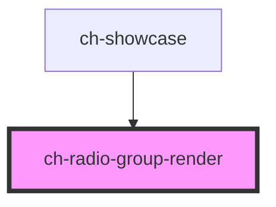

# ch-radio-group-render

<!-- Auto Generated Below -->

## Overview

The `ch-radio-group-render` component renders a group of mutually exclusive
radio options, allowing users to select exactly one value from a short list.

## Features
 - Mutually exclusive selection from a set of options.
 - Horizontal or vertical layout via the `direction` property.
 - Individual item disabling.
 - Accessible labels for each option.
 - Form-associated via `ElementInternals`.

## Use when
 - A small, static set of options where all choices should be visible at once.
 - Exactly one option must be selected from the group.
 - The user must choose exactly one option from 2–7 mutually exclusive choices.
 - All options should be visible simultaneously so users can compare before deciding.
 - The choice is part of a form that requires a submit step.

## Do not use when
 - The option list is long or searchable — prefer `ch-combo-box-render` instead.
 - Multiple options can be selected — prefer `ch-checkbox` instead.
 - More than 7–8 options are available — prefer `ch-combo-box-render`.
 - The setting takes immediate effect — prefer `ch-switch`.
 - A single radio button is used in isolation — radio inputs must always work as a group and cannot be unchecked once selected.

## Accessibility
 - Form-associated via `ElementInternals` — participates in native form validation and submission.
 - Delegates focus into the shadow DOM (`delegatesFocus: true`).
 - The host element has `role="radiogroup"`.
 - Each option uses a native `<input type="radio">` with a linked `<label>`.
 - When no caption is provided, the radio input receives an `aria-label`.
 - The decorative option overlay is hidden from assistive technology with `aria-hidden`.
## Properties

| Property    | Attribute   | Description                                                                                                                                                  | Type                         | Default        |
| ----------- | ----------- | ------------------------------------------------------------------------------------------------------------------------------------------------------------ | ---------------------------- | -------------- |
| `direction` | `direction` | Specifies the direction of the items.                                                                                                                        | `"horizontal" \| "vertical"` | `"horizontal"` |
| `disabled`  | `disabled`  | This attribute lets you specify if the radio-group is disabled. If disabled, it will not fire any user interaction related event (for example, click event). | `boolean`                    | `false`        |
| `model`     | --          | This property lets you define the items of the ch-radio-group-render control.                                                                                | `RadioGroupItemModel[]`      | `undefined`    |
| `value`     | `value`     | The value of the control.                                                                                                                                    | `string`                     | `undefined`    |

## Events

| Event    | Description                                                                                    | Type                  |
| -------- | ---------------------------------------------------------------------------------------------- | --------------------- |
| `change` | Fired when the selected item change. It contains the information about the new selected value. | `CustomEvent<string>` |

## Shadow Parts

| Part                 | Description                                                                                                                                       |
| -------------------- | ------------------------------------------------------------------------------------------------------------------------------------------------- |
| `"checked"`          | Present in the `radio-item`, `radio__option`, `radio__label` and `radio__container` parts when the control is checked (`checked` === `true`).     |
| `"disabled"`         | Present in the `radio-item`, `radio__option`, `radio__label` and `radio__container` parts when the control is disabled (`disabled` === `true`).   |
| `"radio-item"`       | The radio item element.                                                                                                                           |
| `"radio__container"` | The container that serves as a wrapper for the `input` and the `option` parts.                                                                    |
| `"radio__input"`     | The invisible input element that implements the interactions for the component. This part must be kept "invisible".                               |
| `"radio__label"`     | The label that is rendered when the `caption` property is not empty.                                                                              |
| `"radio__option"`    | The actual "input" that is rendered above the `input` part. This part has `position: absolute` and `pointer-events: none`.                        |
| `"unchecked"`        | Present in the `radio-item`, `radio__option`, `radio__label` and `radio__container` parts when the control is not checked (`checked` !== `true`). |

## CSS Custom Properties

| Name                                     | Description                                                                                                      |
| ---------------------------------------- | ---------------------------------------------------------------------------------------------------------------- |
| `--ch-radio-group__radio-container-size` | Specifies the size for the container of the `radio__input` and `radio__option` elements. @default min(1em, 20px) |
| `--ch-radio-group__radio-option-size`    | Specifies the size for the `radio__option` element. @default 50%                                                 |

## Dependencies

### Used by

 - [ch-showcase](../../showcase/assets/components)

### Graph

----------------------------------------------

*Built with [StencilJS](https://stenciljs.com/)*
