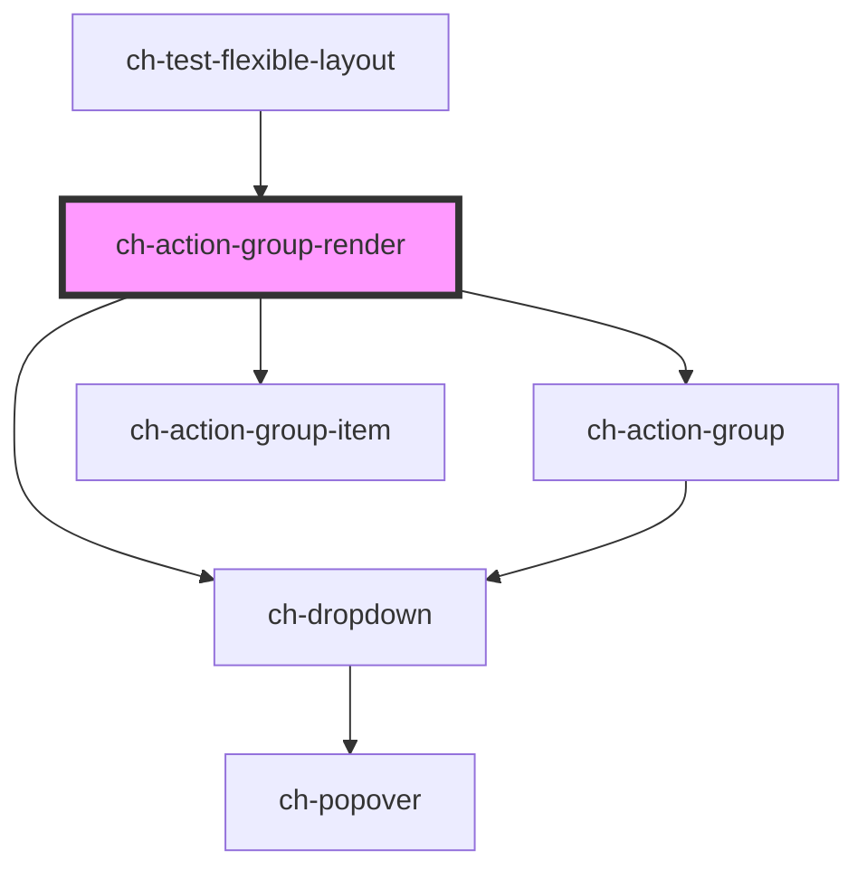

# ch-test-action-group

<!-- Auto Generated Below -->

## Properties

| Property                      | Attribute                        | Description                                                                                                                                                                                                                                                                                                                                                                                                                                                                                                                                                                                                                                                                                                                                                                                                                                                                           | Type                                                                                                                                                                                                                                                                                                                                                                                                                                               | Default                               |
| ----------------------------- | -------------------------------- | ------------------------------------------------------------------------------------------------------------------------------------------------------------------------------------------------------------------------------------------------------------------------------------------------------------------------------------------------------------------------------------------------------------------------------------------------------------------------------------------------------------------------------------------------------------------------------------------------------------------------------------------------------------------------------------------------------------------------------------------------------------------------------------------------------------------------------------------------------------------------------------- | -------------------------------------------------------------------------------------------------------------------------------------------------------------------------------------------------------------------------------------------------------------------------------------------------------------------------------------------------------------------------------------------------------------------------------------------------- | ------------------------------------- |
| `actionGroupExportParts`      | `action-group-export-parts`      | Specifies the parts that are exported by the internal action-group. This property is useful to override the exported parts.                                                                                                                                                                                                                                                                                                                                                                                                                                                                                                                                                                                                                                                                                                                                                           | `string`                                                                                                                                                                                                                                                                                                                                                                                                                                           | `ACTION_GROUP_EXPORT_PARTS`           |
| `cssClass`                    | `css-class`                      | A CSS class to set as the `ch-action-group` element class.                                                                                                                                                                                                                                                                                                                                                                                                                                                                                                                                                                                                                                                                                                                                                                                                                            | `string`                                                                                                                                                                                                                                                                                                                                                                                                                                           | `"action-group"`                      |
| `dropdownExportParts`         | `dropdown-export-parts`          | Specifies the parts that are exported by the internal dropdown. This property is useful to override the exported parts.                                                                                                                                                                                                                                                                                                                                                                                                                                                                                                                                                                                                                                                                                                                                                               | `string`                                                                                                                                                                                                                                                                                                                                                                                                                                           | `DROPDOWN_EXPORT_PARTS`               |
| `gxImageConstructor`          | --                               | This property is a WA to implement the Tree View as a UC 2.0 in GeneXus.                                                                                                                                                                                                                                                                                                                                                                                                                                                                                                                                                                                                                                                                                                                                                                                                              | `(name: string) => any`                                                                                                                                                                                                                                                                                                                                                                                                                            | `undefined`                           |
| `gxSettings`                  | `gx-settings`                    | This property is a WA to implement the Tree View as a UC 2.0 in GeneXus.                                                                                                                                                                                                                                                                                                                                                                                                                                                                                                                                                                                                                                                                                                                                                                                                              | `any`                                                                                                                                                                                                                                                                                                                                                                                                                                              | `undefined`                           |
| `itemClickCallback`           | --                               | This callback is executed when an item is clicked.                                                                                                                                                                                                                                                                                                                                                                                                                                                                                                                                                                                                                                                                                                                                                                                                                                    | `(event: UIEvent, target: string, itemId: string) => void`                                                                                                                                                                                                                                                                                                                                                                                         | `undefined`                           |
| `itemsOverflowBehavior`       | `items-overflow-behavior`        | This attribute determines how items behave when the content of the ActionGroup overflows horizontal. This property is needed to make the control responsive to changes in the Width of the container of ActionGroup.  \| Value                 \| Details                                                                                          \| \| --------------------- \| ------------------------------------------------------------------------------------------------ \| \| `Add Scroll`          \| The items of the ActionGroup that overflow horizontally are shown by means of a scroll.          \| \| `Multiline`           \| The ActionGroup items that overflow horizontally are shown in a second line of the control.      \| \| `Responsive Collapse` \| The Action Group items, when they start to overflow the control, are placed in the More Actions. \| | `"AddScroll" \| "Multiline" \| "ResponsiveCollapse"`                                                                                                                                                                                                                                                                                                                                                                                               | `"ResponsiveCollapse"`                |
| `model`                       | --                               | This property lets you define the model of the ch-action-group control.                                                                                                                                                                                                                                                                                                                                                                                                                                                                                                                                                                                                                                                                                                                                                                                                               | `ActionGroupItemModel[]`                                                                                                                                                                                                                                                                                                                                                                                                                           | `undefined`                           |
| `moreActionsAccessibleName`   | `more-actions-accessible-name`   | This attribute lets you specify the label for the more actions button. Important for accessibility.                                                                                                                                                                                                                                                                                                                                                                                                                                                                                                                                                                                                                                                                                                                                                                                   | `string`                                                                                                                                                                                                                                                                                                                                                                                                                                           | `"Show options"`                      |
| `moreActionsDropdownPosition` | `more-actions-dropdown-position` | Specifies the position of the dropdown section that is placed relative to the more actions button.                                                                                                                                                                                                                                                                                                                                                                                                                                                                                                                                                                                                                                                                                                                                                                                    | `"Center_OutsideEnd" \| "Center_OutsideStart" \| "InsideEnd_OutsideEnd" \| "InsideEnd_OutsideStart" \| "InsideStart_OutsideEnd" \| "InsideStart_OutsideStart" \| "OutsideEnd_Center" \| "OutsideEnd_InsideEnd" \| "OutsideEnd_InsideStart" \| "OutsideEnd_OutsideEnd" \| "OutsideEnd_OutsideStart" \| "OutsideStart_Center" \| "OutsideStart_InsideEnd" \| "OutsideStart_InsideStart" \| "OutsideStart_OutsideEnd" \| "OutsideStart_OutsideStart"` | `"InsideStart_OutsideEnd"`            |
| `openOnFocus`                 | `open-on-focus`                  | Determine if the dropdown section should be opened when the expandable button of the control is focused. TODO: Add implementation                                                                                                                                                                                                                                                                                                                                                                                                                                                                                                                                                                                                                                                                                                                                                     | `boolean`                                                                                                                                                                                                                                                                                                                                                                                                                                          | `false`                               |
| `separatorCssClass`           | `separator-css-class`            | A CSS class to set as the `ch-dropdown-item` element class. This default class is used for the items that don't have an explicit class.                                                                                                                                                                                                                                                                                                                                                                                                                                                                                                                                                                                                                                                                                                                                               | `string`                                                                                                                                                                                                                                                                                                                                                                                                                                           | `"action-group-separator-horizontal"` |
| `useGxRender`                 | `use-gx-render`                  | This property is a WA to implement the Tree View as a UC 2.0 in GeneXus.                                                                                                                                                                                                                                                                                                                                                                                                                                                                                                                                                                                                                                                                                                                                                                                                              | `boolean`                                                                                                                                                                                                                                                                                                                                                                                                                                          | `false`                               |

## Dependencies

### Used by

 - [ch-test-flexible-layout](../../test/test-flexible-layout)

### Depends on

- [ch-dropdown](../../dropdown)
- [ch-action-group](../../action-group/action-group)
- [ch-action-group-item](../../action-group/action-group-item)

### Graph

----------------------------------------------

*Built with [StencilJS](https://stenciljs.com/)*
