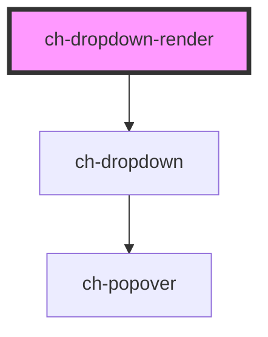

# ch-test-dropdown

<!-- Auto Generated Below -->

## Properties

| Property               | Attribute                | Description                                                                                                                             | Type                                                                                                                                                                                                                                                                                                                                                                                                                                               | Default                 |
| ---------------------- | ------------------------ | --------------------------------------------------------------------------------------------------------------------------------------- | -------------------------------------------------------------------------------------------------------------------------------------------------------------------------------------------------------------------------------------------------------------------------------------------------------------------------------------------------------------------------------------------------------------------------------------------------- | ----------------------- |
| `buttonAccessibleName` | `button-accessible-name` | This attribute lets you specify the label for the first expandable button. Important for accessibility.                                 | `string`                                                                                                                                                                                                                                                                                                                                                                                                                                           | `undefined`             |
| `cssClass`             | `css-class`              | A CSS class to set as the `ch-dropdown` element class.                                                                                  | `string`                                                                                                                                                                                                                                                                                                                                                                                                                                           | `"dropdown"`            |
| `exportParts`          | `export-parts`           | Specifies the parts that are exported by the internal dropdown. This property is useful to override the exported parts.                 | `string`                                                                                                                                                                                                                                                                                                                                                                                                                                           | `DROPDOWN_EXPORT_PARTS` |
| `gxImageConstructor`   | --                       | This property is a WA to implement the Tree View as a UC 2.0 in GeneXus.                                                                | `(name: string) => any`                                                                                                                                                                                                                                                                                                                                                                                                                            | `undefined`             |
| `gxSettings`           | `gx-settings`            | This property is a WA to implement the Tree View as a UC 2.0 in GeneXus.                                                                | `any`                                                                                                                                                                                                                                                                                                                                                                                                                                              | `undefined`             |
| `itemClickCallback`    | --                       | This callback is executed when an item is clicked.                                                                                      | `(event: UIEvent, target: string, itemId: string) => void`                                                                                                                                                                                                                                                                                                                                                                                         | `undefined`             |
| `model`                | --                       | This property lets you define the model of the ch-dropdown control.                                                                     | `DropdownItemModel[]`                                                                                                                                                                                                                                                                                                                                                                                                                              | `undefined`             |
| `position`             | `position`               | Specifies the position of the dropdown section that is placed relative to the expandable button.                                        | `"Center_OutsideEnd" \| "Center_OutsideStart" \| "InsideEnd_OutsideEnd" \| "InsideEnd_OutsideStart" \| "InsideStart_OutsideEnd" \| "InsideStart_OutsideStart" \| "OutsideEnd_Center" \| "OutsideEnd_InsideEnd" \| "OutsideEnd_InsideStart" \| "OutsideEnd_OutsideEnd" \| "OutsideEnd_OutsideStart" \| "OutsideStart_Center" \| "OutsideStart_InsideEnd" \| "OutsideStart_InsideStart" \| "OutsideStart_OutsideEnd" \| "OutsideStart_OutsideStart"` | `"Center_OutsideEnd"`   |
| `separatorCssClass`    | `separator-css-class`    | A CSS class to set as the `ch-dropdown-item` element class. This default class is used for the items that don't have an explicit class. | `string`                                                                                                                                                                                                                                                                                                                                                                                                                                           | `"dropdown-separator"`  |
| `useGxRender`          | `use-gx-render`          | This property is a WA to implement the Tree View as a UC 2.0 in GeneXus.                                                                | `boolean`                                                                                                                                                                                                                                                                                                                                                                                                                                          | `false`                 |

## Dependencies

### Depends on

- [ch-dropdown](../../dropdown)

### Graph

----------------------------------------------

*Built with [StencilJS](https://stenciljs.com/)*
