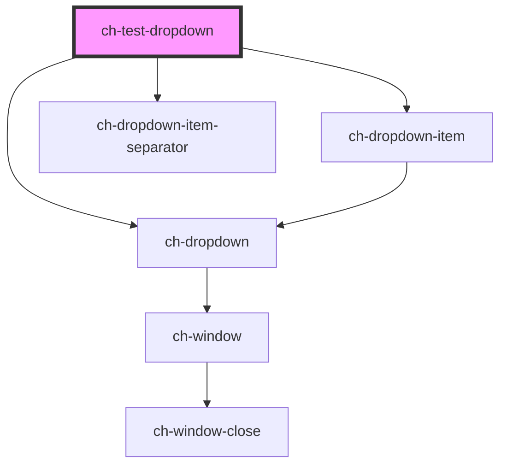

# ch-test-dropdown

<!-- Auto Generated Below -->

## Properties

| Property         | Attribute         | Description                                                                                                 | Type                                                                                                                                                                                                                                                                                                                                                                                                                                               | Default               |
| ---------------- | ----------------- | ----------------------------------------------------------------------------------------------------------- | -------------------------------------------------------------------------------------------------------------------------------------------------------------------------------------------------------------------------------------------------------------------------------------------------------------------------------------------------------------------------------------------------------------------------------------------------- | --------------------- |
| `buttonLabel`    | `button-label`    | This attribute lets you specify the label for the expandable button. Important for accessibility.           | `string`                                                                                                                                                                                                                                                                                                                                                                                                                                           | `"Show options"`      |
| `expandBehavior` | `expand-behavior` | Determine which actions on the expandable button display the dropdown section.                              | `"Click" \| "ClickOrHover"`                                                                                                                                                                                                                                                                                                                                                                                                                        | `"ClickOrHover"`      |
| `itemsModel`     | --                | This property lets you define the model of the ch-dropdown control.                                         | `DropdownItemModel[]`                                                                                                                                                                                                                                                                                                                                                                                                                              | `undefined`           |
| `openOnFocus`    | `open-on-focus`   | Determine if the dropdown section should be opened when the expandable button of the control is focused.    | `boolean`                                                                                                                                                                                                                                                                                                                                                                                                                                          | `false`               |
| `position`       | `position`        | Specifies the position of the dropdown section that is placed relative to the expandable button.            | `"Center_OutsideEnd" \| "Center_OutsideStart" \| "InsideEnd_OutsideEnd" \| "InsideEnd_OutsideStart" \| "InsideStart_OutsideEnd" \| "InsideStart_OutsideStart" \| "OutsideEnd_Center" \| "OutsideEnd_InsideEnd" \| "OutsideEnd_InsideStart" \| "OutsideEnd_OutsideEnd" \| "OutsideEnd_OutsideStart" \| "OutsideStart_Center" \| "OutsideStart_InsideEnd" \| "OutsideStart_InsideStart" \| "OutsideStart_OutsideEnd" \| "OutsideStart_OutsideStart"` | `"Center_OutsideEnd"` |
| `separation`     | `separation`      | Specifies the separation (in pixels) between the expandable button and the dropdown section of the control. | `number`                                                                                                                                                                                                                                                                                                                                                                                                                                           | `0`                   |

## Dependencies

### Depends on

- [ch-dropdown-item](../../dropdown-item)
- [ch-dropdown-item-separator](../../dropdown-item-separator)
- [ch-dropdown](../../dropdown)

### Graph

----------------------------------------------

*Built with [StencilJS](https://stenciljs.com/)*
