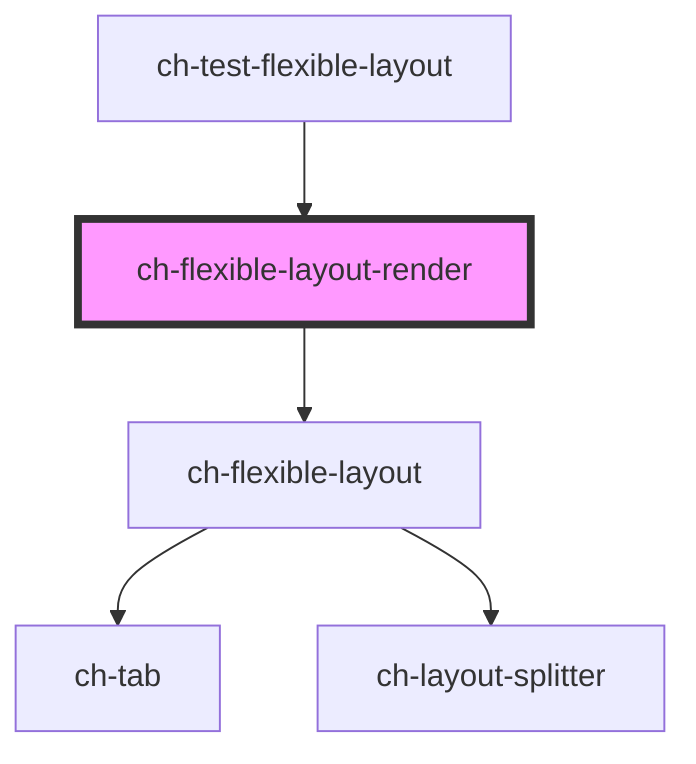

# ch-flexible-layout-render

The `ch-flexible-layout-render` control is a shell composed of lightweight modular widgets that provide a solid foundation for draggable dock layouts.

<!-- Auto Generated Below -->

## Properties

| Property   | Attribute   | Description                                                     | Type                                                                           | Default             |
| ---------- | ----------- | --------------------------------------------------------------- | ------------------------------------------------------------------------------ | ------------------- |
| `cssClass` | `css-class` | A CSS class to set as the `ch-flexible-layout` element class.   | `string`                                                                       | `"flexible-layout"` |
| `layout`   | --          | Specifies the distribution of the items in the flexible layout. | `Omit<LayoutSplitterDistribution, "items"> & { items: FlexibleLayoutItem[]; }` | `undefined`         |
| `renders`  | --          | Specifies the distribution of the items in the flexible layout. | `{ [key: string]: () => any; }`                                                | `undefined`         |

## Methods

### `addSiblingView(parentGroup: string, siblingItem: string, placedInTheSibling: "before" | "after", viewInfo: FlexibleLayoutLeaf, takeHalfTheSpaceOfTheSiblingItem: boolean) => Promise<boolean>`

Add a view with widgets to render. The view will take the half space of
the sibling view that its added with.

#### Parameters

| Name                               | Type                                                                                                                                                        | Description |
| ---------------------------------- | ----------------------------------------------------------------------------------------------------------------------------------------------------------- | ----------- |
| `parentGroup`                      | `string`                                                                                                                                                    |             |
| `siblingItem`                      | `string`                                                                                                                                                    |             |
| `placedInTheSibling`               | `"after" \| "before"`                                                                                                                                       |             |
| `viewInfo`                         | `LayoutSplitterDistributionLeaf & { accessibleRole?: ViewAccessibleRole; selectedWidgetId?: string; viewType: ViewType; widgets: FlexibleLayoutWidget[]; }` |             |
| `takeHalfTheSpaceOfTheSiblingItem` | `boolean`                                                                                                                                                   |             |

#### Returns

Type: `Promise<boolean>`

### `removeView(viewId: string, removeRenderedWidgets: boolean) => Promise<FlexibleLayoutViewRemoveResult>`

Removes a view and optionally all its rendered widget from the render.
The reserved space will be given to the closest view.

#### Parameters

| Name                    | Type      | Description |
| ----------------------- | --------- | ----------- |
| `viewId`                | `string`  |             |
| `removeRenderedWidgets` | `boolean` |             |

#### Returns

Type: `Promise<FlexibleLayoutViewRemoveResult>`

## Dependencies

### Used by

 - [ch-test-flexible-layout](../../test/test-flexible-layout)

### Depends on

- [ch-flexible-layout](../../flexible-layout)

### Graph

----------------------------------------------

*Built with [StencilJS](https://stenciljs.com/)*
