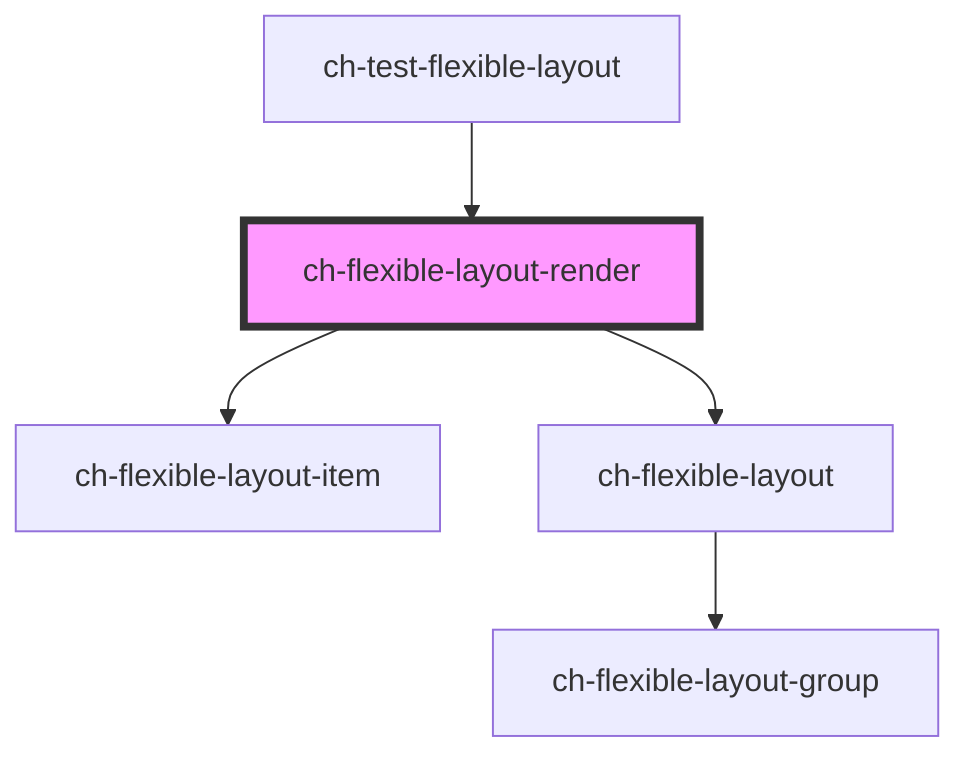

# ch-flexible-layout-render

The `ch-flexible-layout-render` control is a shell composed of lightweight modular widgets that provide a solid foundation for draggable dock layouts.

<!-- Auto Generated Below -->

## Properties

| Property   | Attribute   | Description                                                     | Type                                                                                                                                                                                                                                                                                                     | Default             |
| ---------- | ----------- | --------------------------------------------------------------- | -------------------------------------------------------------------------------------------------------------------------------------------------------------------------------------------------------------------------------------------------------------------------------------------------------- | ------------------- |
| `cssClass` | `css-class` | A CSS class to set as the `ch-flexible-layout` element class.   | `string`                                                                                                                                                                                                                                                                                                 | `"flexible-layout"` |
| `layout`   | --          | Specifies the distribution of the items in the flexible layout. | `{ blockStart?: { items: FlexibleLayoutItemBase[]; }; inlineStart?: { expanded?: boolean; items: FlexibleLayoutItem[]; }; main?: { items: FlexibleLayoutItem[]; }; inlineEnd?: { expanded?: boolean; items: FlexibleLayoutItem[]; }; blockEnd?: { expanded?: boolean; items: FlexibleLayoutItem[]; }; }` | `undefined`         |
| `renders`  | --          | Specifies the distribution of the items in the flexible layout. | `{ [key: string]: () => any; }`                                                                                                                                                                                                                                                                          | `undefined`         |

## Dependencies

### Used by

 - [ch-test-flexible-layout](../../test/test-flexible-layout)

### Depends on

- [ch-flexible-layout-item](../../flexible-layout/flexible-layout-item)
- [ch-flexible-layout](../../flexible-layout/flexible-layout)

### Graph

----------------------------------------------

*Built with [StencilJS](https://stenciljs.com/)*
