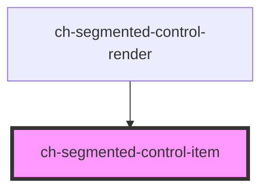

# ch-segmented-control-item

<!-- Auto Generated Below -->

## Overview

Segmented control is used to pick one choice from a linear set of closely related choices, and immediately apply that selection.
This control represents and item of the ch-segmented-control-render

## Properties

| Property         | Attribute         | Description                                                                                                                                                       | Type                     | Default        |
| ---------------- | ----------------- | ----------------------------------------------------------------------------------------------------------------------------------------------------------------- | ------------------------ | -------------- |
| `accessibleName` | `accessible-name` | Specifies a short string, typically 1 to 3 words, that authors associate with an element to provide users of assistive technologies with a label for the element. | `string`                 | `undefined`    |
| `between`        | `between`         | `true` if the control is the not the first or last item in the ch-segmented-control-render.                                                                       | `boolean`                | `false`        |
| `caption`        | `caption`         | Specifies the caption that the control will display.                                                                                                              | `string`                 | `undefined`    |
| `disabled`       | `disabled`        | This attribute lets you specify if the element is disabled. If disabled, it will not fire any user interaction related event (for example, click event).          | `boolean`                | `false`        |
| `endImgSrc`      | `end-img-src`     | Specifies the src of the end image.                                                                                                                               | `string`                 | `undefined`    |
| `endImgType`     | `end-img-type`    | Specifies how the end image will be rendered.                                                                                                                     | `"background" \| "mask"` | `"background"` |
| `first`          | `first`           | `true` if the control is the first item in the ch-segmented-control-render.                                                                                       | `boolean`                | `false`        |
| `last`           | `last`            | `true` if the control is the last item in the ch-segmented-control-render.                                                                                        | `boolean`                | `false`        |
| `selected`       | `selected`        | Specifies if the control is selected.                                                                                                                             | `boolean`                | `undefined`    |
| `startImgSrc`    | `start-img-src`   | Specifies the src of the start image.                                                                                                                             | `string`                 | `undefined`    |
| `startImgType`   | `start-img-type`  | Specifies how the start image will be rendered.                                                                                                                   | `"background" \| "mask"` | `"background"` |

## Events

| Event            | Description                                             | Type                  |
| ---------------- | ------------------------------------------------------- | --------------------- |
| `selectedChange` | Fired when the control is selected by user interaction. | `CustomEvent<string>` |

## Shadow Parts

| Part         | Description |
| ------------ | ----------- |
| `"selected"` | ...         |

## Dependencies

### Used by

 - [ch-segmented-control-render](../..)

### Graph

----------------------------------------------

*Built with [StencilJS](https://stenciljs.com/)*
