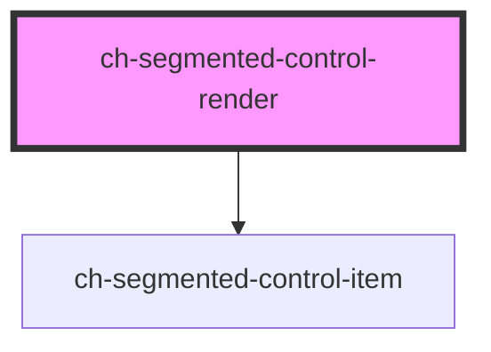

# ch-segmented-control-render

<!-- Auto Generated Below -->

## Overview

Segmented control is used to pick one choice from a linear set of closely related choices, and immediately apply that selection.

## Properties

| Property       | Attribute        | Description                                                                                                                                      | Type                     | Default                          |
| -------------- | ---------------- | ------------------------------------------------------------------------------------------------------------------------------------------------ | ------------------------ | -------------------------------- |
| `exportParts`  | `export-parts`   | Specifies the parts that are exported by the internal segmented-control-item. This property is useful to override the exported parts.            | `string`                 | `SEGMENTED_CONTROL_EXPORT_PARTS` |
| `itemCssClass` | `item-css-class` | A CSS class to set as the `ch-segmented-control-item` element class. This default class is used for the items that don't have an explicit class. | `string`                 | `"segmented-control-item"`       |
| `items`        | --               | This property lets you define the items of the ch-segmented-control-render control.                                                              | `SegmentedControlItem[]` | `undefined`                      |
| `selectedId`   | `selected-id`    | Specifies the ID of the selected item                                                                                                            | `string`                 | `undefined`                      |

## Events

| Event                | Description                                                                                 | Type                  |
| -------------------- | ------------------------------------------------------------------------------------------- | --------------------- |
| `selectedItemChange` | Fired when the selected item change. It contains the information about the new selected id. | `CustomEvent<string>` |

## Dependencies

### Depends on

- [ch-segmented-control-item](./internal/segmented-control-item)

### Graph

----------------------------------------------

*Built with [StencilJS](https://stenciljs.com/)*
