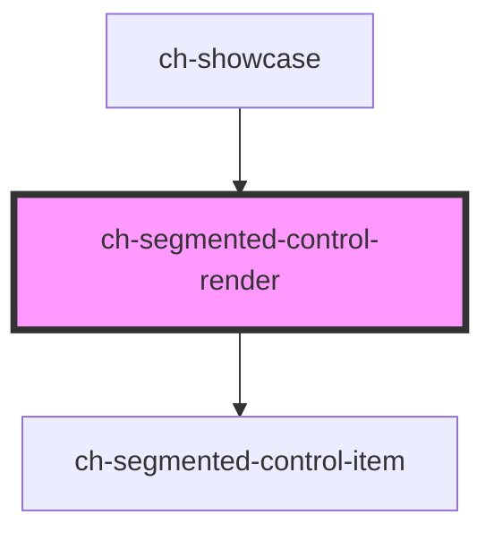

# ch-segmented-control-render

<!-- Auto Generated Below -->

## Overview

The `ch-segmented-control-render` component presents a horizontal set of mutually exclusive options as a row of connected segments.

## Features
 - Connected segment buttons for mutually exclusive selection.
 - Each segment supports a caption, start and end images.
 - Individual segment disabling.
 - Delegates rendering to `ch-segmented-control-item` elements with re-exported parts via `exportParts`.

## Use when
 - Toggling between views, modes, or filters with a small number of options (typically 2 to 5).
 - Immediate selection feedback is desired.
 - Switching between 2–5 mutually exclusive views of the same content (e.g., list vs. grid, day/week/month).
 - The result changes immediately without a confirmation step.

## Do not use when
 - The option list is long — prefer `ch-combo-box-render` or `ch-radio-group-render` instead.
 - More than 5 options are needed — prefer `ch-radio-group-render` or `ch-combo-box-render`.
 - Used inside a form where the selection must be saved — prefer radio buttons.
 - The segments navigate to different pages or routes — prefer `ch-tab` or navigation links.
 - Confusing with `ch-tab`: segmented controls switch the FORMAT or VIEW of the same data; tabs switch to DIFFERENT content sections.

## Accessibility
 - The host element has `role="list"`, and each segment item acts as a list item.
 - Selection changes are communicated via events to assistive technology.

## Properties

| Property       | Attribute        | Description                                                                                                                                      | Type                          | Default                          |
| -------------- | ---------------- | ------------------------------------------------------------------------------------------------------------------------------------------------ | ----------------------------- | -------------------------------- |
| `exportParts`  | `export-parts`   | Specifies the parts that are exported by the internal segmented-control-item. This property is useful to override the exported parts.            | `string`                      | `SEGMENTED_CONTROL_EXPORT_PARTS` |
| `itemCssClass` | `item-css-class` | A CSS class to set as the `ch-segmented-control-item` element class. This default class is used for the items that don't have an explicit class. | `string`                      | `"segmented-control-item"`       |
| `model`        | --               | This property lets you define the items of the ch-segmented-control-render control.                                                              | `SegmentedControlItemModel[]` | `undefined`                      |
| `selectedId`   | `selected-id`    | Specifies the ID of the selected item                                                                                                            | `string`                      | `undefined`                      |

## Events

| Event                | Description                                                                                 | Type                  |
| -------------------- | ------------------------------------------------------------------------------------------- | --------------------- |
| `selectedItemChange` | Fired when the selected item change. It contains the information about the new selected id. | `CustomEvent<string>` |

## Shadow Parts

| Part           | Description                                                                                                                             |
| -------------- | --------------------------------------------------------------------------------------------------------------------------------------- |
| `"action"`     | The `<button>` element for each segment. Receives the `selected`, `unselected`, `disabled`, `first`, `last`, and `between` state parts. |
| `"between"`    | Present in the `action` part when the segment is neither the first nor the last item.                                                   |
| `"disabled"`   | Present in the `action` part when the segment is disabled.                                                                              |
| `"first"`      | Present in the `action` part when the segment is the first item in the group.                                                           |
| `"last"`       | Present in the `action` part when the segment is the last item in the group.                                                            |
| `"selected"`   | Present in the `action` part when the segment is the currently selected one.                                                            |
| `"unselected"` | Present in the `action` part when the segment is not selected.                                                                          |

## Dependencies

### Used by

 - [ch-showcase](../../showcase/assets/components)

### Depends on

- [ch-segmented-control-item](./internal/segmented-control-item)

### Graph

```mermaid
graph TD;
  ch-segmented-control-render --> ch-segmented-control-item
  ch-showcase --> ch-segmented-control-render
  style ch-segmented-control-render fill:#f9f,stroke:#333,stroke-width:4px
```

----------------------------------------------

*Built with [StencilJS](https://stenciljs.com/)*
