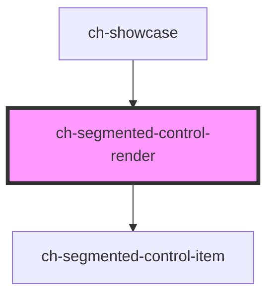

# ch-segmented-control-render

## Table of Contents

- [Overview](#overview)
- [Features](#features)
- [Use when](#use-when)
- [Do not use when](#do-not-use-when)
- [Accessibility](#accessibility)
- [Properties](#properties)
- [Events](#events)
- [Dependencies](#dependencies)
  - [Used by](#used-by)
  - [Depends on](#depends-on)
  - [Graph](#graph)
- [Styling](./docs/styling.md)

<!-- Auto Generated Below -->

## Overview

The `ch-segmented-control-render` component presents a horizontal set of mutually exclusive options as a row of connected segments.

## Features
 - Connected segment buttons for mutually exclusive selection.
 - Each segment supports a caption, start and end images.
 - Individual segment disabling.
 - Delegates rendering to `ch-segmented-control-item` elements with re-exported parts via `exportParts`.

## Use when
 - Toggling between views, modes, or filters with a small number of options (typically 2 to 5).
 - Immediate selection feedback is desired.
 - Switching between 2–5 mutually exclusive views of the same content (e.g., list vs. grid, day/week/month).
 - The result changes immediately without a confirmation step.

## Do not use when
 - The option list is long — prefer `ch-combo-box-render` or `ch-radio-group-render` instead.
 - More than 5 options are needed — prefer `ch-radio-group-render` or `ch-combo-box-render`.
 - Used inside a form where the selection must be saved — prefer radio buttons.
 - The segments navigate to different pages or routes — prefer `ch-tab` or navigation links.
 - Confusing with `ch-tab`: segmented controls switch the FORMAT or VIEW of the same data; tabs switch to DIFFERENT content sections.

## Accessibility
 - The host element has `role="list"`, and each `ch-segmented-control-item` child renders with `role="listitem"`, following the ARIA list pattern.
 - The selected segment is visually distinguished via CSS parts (`selected` / `unselected`); ensure custom styles provide sufficient contrast for assistive technology.
 - Selection changes are communicated via the `selectedItemChange` event to assistive technology.

## Properties

| Property       | Attribute        | Description                                                                                                                                                                                                                                                                                                                                               | Type                          | Default                          |
| -------------- | ---------------- | --------------------------------------------------------------------------------------------------------------------------------------------------------------------------------------------------------------------------------------------------------------------------------------------------------------------------------------------------------- | ----------------------------- | -------------------------------- |
| `exportParts`  | `export-parts`   | Specifies the parts that are exported by the internal segmented-control-item. This property is useful to override the exported parts.  **Caution:** Overriding this value can break the parts API for external consumers that rely on the default exported part names. Only change this if you need to remap or restrict the exposed parts intentionally. | `string`                      | `SEGMENTED_CONTROL_EXPORT_PARTS` |
| `itemCssClass` | `item-css-class` | A CSS class applied to the host element of each `ch-segmented-control-item`, not to the inner `<button>`. This default class is used for items that do not have an explicit `class` property in their model entry.                                                                                                                                        | `string`                      | `"segmented-control-item"`       |
| `model`        | --               | Defines the items rendered by the segmented control.                                                                                                                                                                                                                                                                                                      | `SegmentedControlItemModel[]` | `undefined`                      |
| `selectedId`   | `selected-id`    | Specifies the ID of the selected item. The value must match an `id` from the `model` array; if no item matches, no segment is visually selected.  This property is mutable: it is updated internally when the user clicks a segment, so the host can read back the current selection at any time.                                                         | `string`                      | `undefined`                      |

## Events

| Event                | Description                                                                                                                                                                                                  | Type                  |
| -------------------- | ------------------------------------------------------------------------------------------------------------------------------------------------------------------------------------------------------------ | --------------------- |
| `selectedItemChange` | Fired when the selected item changes due to user interaction (click). It is **not** emitted when `selectedId` is changed programmatically. The event detail contains the `id` of the newly selected segment. | `CustomEvent<string>` |

## Dependencies

### Used by

 - [ch-showcase](../../showcase/assets/components)

### Depends on

- [ch-segmented-control-item](./internal/segmented-control-item)

### Graph

```mermaid
graph TD;
  ch-segmented-control-render --> ch-segmented-control-item
  ch-showcase --> ch-segmented-control-render
  style ch-segmented-control-render fill:#f9f,stroke:#333,stroke-width:4px
```

----------------------------------------------

*Built with [StencilJS](https://stenciljs.com/)*
