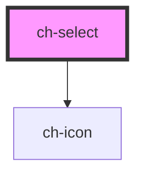

# ch-select

<!-- Auto Generated Below -->

## Properties

| Property       | Attribute        | Description                                                  | Type      | Default     |
| -------------- | ---------------- | ------------------------------------------------------------ | --------- | ----------- |
| `arrowIconSrc` | `arrow-icon-src` |                                                              | `string`  | `undefined` |
| `autoColor`    | `auto-color`     | If enabled, the icon will display its inherent/natural color | `boolean` | `false`     |
| `disabled`     | `disabled`       |                                                              | `boolean` | `undefined` |
| `height`       | `height`         |                                                              | `string`  | `undefined` |
| `iconSrc`      | `icon-src`       |                                                              | `string`  | `undefined` |
| `name`         | `name`           |                                                              | `string`  | `undefined` |
| `optionHeight` | `option-height`  |                                                              | `string`  | `undefined` |
| `width`        | `width`          |                                                              | `string`  | `undefined` |

## Events

| Event                | Description        | Type               |
| -------------------- | ------------------ | ------------------ |
| `onToggle`           |                    | `CustomEvent<any>` |
| `optionClickedEvent` | Emmits the item id | `CustomEvent<any>` |

## Shadow Parts

| Part               | Description |
| ------------------ | ----------- |
| `"collapse-icon"`  |             |
| `"select-box"`     |             |
| `"select-options"` |             |

## CSS Custom Properties

| Name                      | Description                      |
| ------------------------- | -------------------------------- |
| `--arrow-color`           | The color of the arrow icon      |
| `--font-family`           | The select's font family         |
| `--font-size`             | The item's font size             |
| `--icon-color`            | The color of the item's icon     |
| `--icon-size`             | The size of the item's icon      |
| `--item-active-color`     | The color of active item         |
| `--item-hover-color`      | The color of the item on hover   |
| `--justify-content`       | content position handling        |
| `--menu-background-color` | The background color of the menu |
| `--padding-left`          | select's left padding            |
| `--padding-right`         | select's right padding           |
| `--text-color`            | The color of the text            |
| `--title-font-weight`     | The select's text font weight    |

## Dependencies

### Depends on

- [ch-icon](../icon)

### Graph

----------------------------------------------

*Built with [StencilJS](https://stenciljs.com/)*
