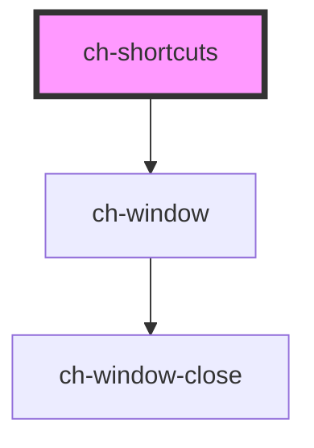

# ch-keyboard

<!-- Auto Generated Below -->

## Properties

| Property           | Attribute  | Description                          | Type      | Default     |
| ------------------ | ---------- | ------------------------------------ | --------- | ----------- |
| `showKey`          | `show-key` | Key to show shortcut tooltips.       | `"F10"`   | `"F10"`     |
| `src` _(required)_ | `src`      | The URL of the shortcut definitions. | `string`  | `undefined` |
| `suspend`          | `suspend`  | Suspend shortcuts.                   | `boolean` | `false`     |

## Shadow Parts

| Part      | Description |
| --------- | ----------- |
| `"plus"`  |             |
| `"slash"` |             |

## Dependencies

### Depends on

- [ch-window](../../deprecated-components/window)

### Graph

----------------------------------------------

*Built with [StencilJS](https://stenciljs.com/)*
