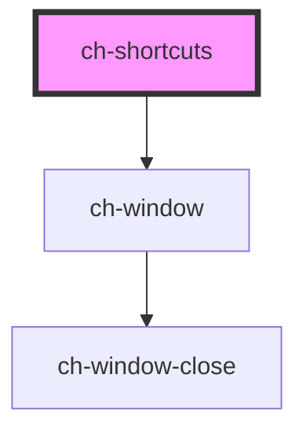

# ch-shortcuts

## Table of Contents

- [Overview](#overview)
- [Features](#features)
- [Use when](#use-when)
- [Do not use when](#do-not-use-when)
- [Accessibility](#accessibility)
- [Properties](#properties)
- [Dependencies](#dependencies)
  - [Depends on](#depends-on)
  - [Graph](#graph)
- [Styling](./docs/styling.md)

<!-- Auto Generated Below -->

## Overview

The `ch-shortcuts` component loads keyboard shortcut definitions from a JSON file and displays discoverable tooltip hints next to target elements when the user presses a trigger key.

## Features
 - Loads shortcut definitions from an external JSON file.
 - Toggles visual key-combination hints on/off via a configurable trigger key (default F10).
 - Tooltips positioned relative to target elements using `ch-window`.
 - Auto-hides hints when any non-modifier key is pressed.
 - Runtime suspend/resume without unloading the hint UI.

## Use when
 - Your application provides power-user keyboard shortcuts and you want a discoverable overlay similar to desktop productivity tools.
 - Providing discoverable keyboard shortcut hints for power users in a complex application.

## Do not use when
 - You need to define keyboard bindings -- this component only visualizes externally configured shortcuts.
 - Keyboard shortcuts do not exist or are not implemented in the application.

## Accessibility
 - Shortcut hints are rendered using `<kbd>` elements for proper semantic meaning.
 - Triggered by a configurable key (default F10), respecting modifier key state.

## Properties

| Property           | Attribute  | Description                          | Type      | Default     |
| ------------------ | ---------- | ------------------------------------ | --------- | ----------- |
| `showKey`          | `show-key` | Key to show shortcut tooltips.       | `"F10"`   | `"F10"`     |
| `src` _(required)_ | `src`      | The URL of the shortcut definitions. | `string`  | `undefined` |
| `suspend`          | `suspend`  | Suspend shortcuts.                   | `boolean` | `false`     |

## Dependencies

### Depends on

- [ch-window](../../deprecated-components/window)

### Graph

```mermaid
graph TD;
  ch-shortcuts --> ch-window
  ch-window --> ch-window-close
  style ch-shortcuts fill:#f9f,stroke:#333,stroke-width:4px
```

----------------------------------------------

*Built with [StencilJS](https://stenciljs.com/)*
