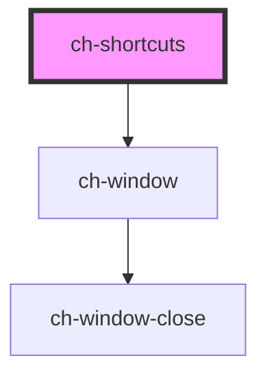

# ch-keyboard

<!-- Auto Generated Below -->

## Overview

The `ch-shortcuts` component loads keyboard shortcut definitions from a JSON
file and displays discoverable tooltip hints next to target elements when the
user presses a trigger key.

## Properties

| Property           | Attribute  | Description                          | Type      | Default     |
| ------------------ | ---------- | ------------------------------------ | --------- | ----------- |
| `showKey`          | `show-key` | Key to show shortcut tooltips.       | `"F10"`   | `"F10"`     |
| `src` _(required)_ | `src`      | The URL of the shortcut definitions. | `string`  | `undefined` |
| `suspend`          | `suspend`  | Suspend shortcuts.                   | `boolean` | `false`     |

## Shadow Parts

| Part      | Description                                                                    |
| --------- | ------------------------------------------------------------------------------ |
| `"key"`   | Each individual `<kbd>` element representing a single key in the shortcut.     |
| `"plus"`  | The "+" separator rendered between keys in a combination (e.g., Ctrl **+** S). |
| `"slash"` | The "/" separator rendered between alternative keys in a shortcut definition.  |

## Dependencies

### Depends on

- [ch-window](../../deprecated-components/window)

### Graph

```mermaid
graph TD;
  ch-shortcuts --> ch-window
  ch-window --> ch-window-close
  style ch-shortcuts fill:#f9f,stroke:#333,stroke-width:4px
```

----------------------------------------------

*Built with [StencilJS](https://stenciljs.com/)*
