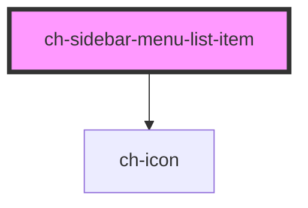

# ch-sidebar-menu-list-item

<!-- Auto Generated Below -->

## Properties

| Property      | Attribute       | Description                         | Type     | Default     |
| ------------- | --------------- | ----------------------------------- | -------- | ----------- |
| `itemIconSrc` | `item-icon-src` | The first list item icon (optional) | `string` | `undefined` |

## Events

| Event              | Description        | Type               |
| ------------------ | ------------------ | ------------------ |
| `itemClickedEvent` | Emmits the item id | `CustomEvent<any>` |

## Dependencies

### Depends on

- [ch-icon](../icon)

### Graph

---

_Built with [StencilJS](https://stenciljs.com/)_
