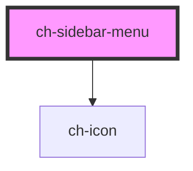

# ch-sidebar-menu

A sidebar menu that collapses

<!-- Auto Generated Below -->

## Usage

### Colors Example

```
    <ch-sidebar-menu menu-title="menu">
      <ch-sidebar-menu-list>
        <ch-sidebar-menu-list-item id="colors">
          Colors
          <ch-sidebar-menu-list slot="list">
            <ch-sidebar-menu-list-item id="warm">
              Warm
              <ch-sidebar-menu-list slot="list">
                <ch-sidebar-menu-list-item id="yellow">
                  Yellow
                </ch-sidebar-menu-list-item>
                <ch-sidebar-menu-list-item id="yellow-orange">
                  Yellow-orange
                </ch-sidebar-menu-list-item>
                <ch-sidebar-menu-list-item id="orange">
                  Orange
                </ch-sidebar-menu-list-item>
                <ch-sidebar-menu-list-item id="red-orange">
                  Red-orange
                </ch-sidebar-menu-list-item>
                <ch-sidebar-menu-list-item id="red">
                  Red
                </ch-sidebar-menu-list-item>
                <ch-sidebar-menu-list-item id="red-violet">
                  Red-violet
                </ch-sidebar-menu-list-item>
              </ch-sidebar-menu-list>
            </ch-sidebar-menu-list-item>
            <ch-sidebar-menu-list-item id="colds">
              Colds
              <ch-sidebar-menu-list slot="list">
                <ch-sidebar-menu-list-item id="violet">
                  Violet
                </ch-sidebar-menu-list-item>
                <ch-sidebar-menu-list-item id="blue-violet">
                  Blue-violet
                </ch-sidebar-menu-list-item>
                <ch-sidebar-menu-list-item id="blue">
                  Blue
                </ch-sidebar-menu-list-item>
                <ch-sidebar-menu-list-item id="blue-green">
                  Blue-green
                </ch-sidebar-menu-list-item>
                <ch-sidebar-menu-list-item id="green">
                  Green
                </ch-sidebar-menu-list-item>
                <ch-sidebar-menu-list-item id="yellow-green">
                  Yellow-green
                </ch-sidebar-menu-list-item>
              </ch-sidebar-menu-list>
            </ch-sidebar-menu-list-item>
          </ch-sidebar-menu-list>
        </ch-sidebar-menu-list-item>
      </ch-sidebar-menu-list>
      <div slot="footer">put somehting usefull on the footer</div>
    </ch-sidebar-menu>
```

## Properties

| Property         | Attribute          | Description                                                                                  | Type      | Default     |
| ---------------- | ------------------ | -------------------------------------------------------------------------------------------- | --------- | ----------- |
| `menuTitle`      | `menu-title`       | The menu title                                                                               | `string`  | `undefined` |
| `singleListOpen` | `single-list-open` | The presence of this attribute allows the menu to have only one list opened at the same time | `boolean` | `false`     |

## Events

| Event         | Description | Type               |
| ------------- | ----------- | ------------------ |
| `itemClicked` |             | `CustomEvent<any>` |

## CSS Custom Properties

| Name                      | Description                      |
| ------------------------- | -------------------------------- |
| `--menu-background-color` | The background color of the menu |

## Dependencies

### Depends on

- [ch-icon](../icon)

### Graph



---

_Built with [StencilJS](https://stenciljs.com/)_
