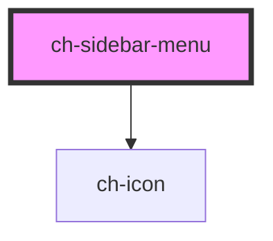

# ch-sidebar-menu

<!-- Auto Generated Below -->

## Properties

| Property    | Attribute    | Description                                                 | Type     | Default     |
| ----------- | ------------ | ----------------------------------------------------------- | -------- | ----------- |
| `menuTitle` | `menu-title` | **\*\*\*\***\***\*\*\*\*** PROPS **\*\*\*\***\***\*\*\*\*** | `string` | `undefined` |

## Dependencies

### Depends on

- [ch-icon](../icon)

### Graph

---

_Built with [StencilJS](https://stenciljs.com/)_
