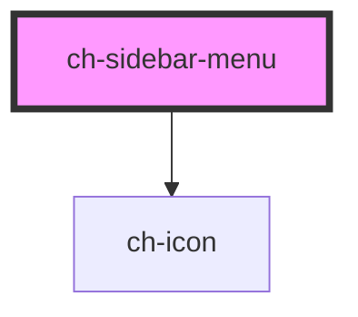

# ch-sidebar-menu-list-item

## Properties

| Property      | Attribute       | Description                         | Type     | Default     |
| ------------- | --------------- | ----------------------------------- | -------- | ----------- |
| `itemIconSrc` | `item-icon-src` | The first list item icon (optional) | `string` | `undefined` |

## Events

| Event              | Description        | Type               |
| ------------------ | ------------------ | ------------------ |
| `itemClickedEvent` | Emmits the item id | `CustomEvent<any>` |

# ch-sidebar-menu

A sidebar menu that collapses

<!-- Auto Generated Below -->


## Usage

### Colors Example / usage

```
    <ch-sidebar-menu menu-title="menu">
      <ch-sidebar-menu-list>
        <ch-sidebar-menu-list-item id="colors">
          Colors
          <ch-sidebar-menu-list slot="list">
            <ch-sidebar-menu-list-item id="warm">
              Warm
              <ch-sidebar-menu-list slot="list">
                <ch-sidebar-menu-list-item id="yellow">
                  Yellow
                </ch-sidebar-menu-list-item>
                <ch-sidebar-menu-list-item id="yellow-orange">
                  Yellow-orange
                </ch-sidebar-menu-list-item>
                <ch-sidebar-menu-list-item id="orange">
                  Orange
                </ch-sidebar-menu-list-item>
                <ch-sidebar-menu-list-item id="red-orange">
                  Red-orange
                </ch-sidebar-menu-list-item>
                <ch-sidebar-menu-list-item id="red">
                  Red
                </ch-sidebar-menu-list-item>
                <ch-sidebar-menu-list-item id="red-violet">
                  Red-violet
                </ch-sidebar-menu-list-item>
              </ch-sidebar-menu-list>
            </ch-sidebar-menu-list-item>
            <ch-sidebar-menu-list-item id="colds">
              Colds
              <ch-sidebar-menu-list slot="list">
                <ch-sidebar-menu-list-item id="violet">
                  Violet
                </ch-sidebar-menu-list-item>
                <ch-sidebar-menu-list-item id="blue-violet">
                  Blue-violet
                </ch-sidebar-menu-list-item>
                <ch-sidebar-menu-list-item id="blue">
                  Blue
                </ch-sidebar-menu-list-item>
                <ch-sidebar-menu-list-item id="blue-green">
                  Blue-green
                </ch-sidebar-menu-list-item>
                <ch-sidebar-menu-list-item id="green">
                  Green
                </ch-sidebar-menu-list-item>
                <ch-sidebar-menu-list-item id="yellow-green">
                  Yellow-green
                </ch-sidebar-menu-list-item>
              </ch-sidebar-menu-list>
            </ch-sidebar-menu-list-item>
          </ch-sidebar-menu-list>
        </ch-sidebar-menu-list-item>
      </ch-sidebar-menu-list>
      <div slot="footer">put somehting usefull on the footer</div>
    </ch-sidebar-menu>
```


## Properties

| Property         | Attribute          | Description                                                                                  | Type      | Default     |
| ---------------- | ------------------ | -------------------------------------------------------------------------------------------- | --------- | ----------- |
| `activeItem`     | `active-item`      | The active item                                                                              | `string`  | `""`        |
| `activeItemId`   | `active-item-id`   | The initial active item (optional)                                                           | `string`  | `""`        |
| `collapsible`    | `collapsible`      | Determines if the menu can be collapsed                                                      | `boolean` | `true`      |
| `distanceToTop`  | `distance-to-top`  | Allows to set the distance to the top of the page on the menu                                | `number`  | `0`         |
| `isCollapsed`    | `is-collapsed`     | Determines if the menu is collapsed                                                          | `boolean` | `undefined` |
| `menuTitle`      | `menu-title`       | The menu title                                                                               | `string`  | `undefined` |
| `singleListOpen` | `single-list-open` | The presence of this attribute allows the menu to have only one list opened at the same time | `boolean` | `false`     |


## Events

| Event                | Description | Type               |
| -------------------- | ----------- | ------------------ |
| `collapseBtnClicked` |             | `CustomEvent<any>` |
| `itemClicked`        |             | `CustomEvent<any>` |


## CSS Custom Properties

| Name                                  | Description                                                     |
| ------------------------------------- | --------------------------------------------------------------- |
| `--first-list-arrow-color`            | The color of the first list arrow icon                          |
| `--first-list-font-size`              | The item font size for the first list items                     |
| `--first-list-icon-color`             | The color of the first list icon                                |
| `--first-list-line-height`            | The item line height for the first list items                   |
| `--first-list-text-transform`         | The item text transform for the first list items                |
| `--first-list-text-vertical-padding`  | The vertical padding (top and bottom) for the first list items  |
| `--footer-font-size`                  | The footer font size                                            |
| `--footer-line`                       | The color of the footer separator line                          |
| `--indicator-color`                   | The color of the lateral indicator                              |
| `--item-active-color`                 | The color of active item                                        |
| `--item-hover-color`                  | The color of the item on hover                                  |
| `--menu-background-color`             | The background color of the menu                                |
| `--scrollbar-thumb`                   | The color of the scrollbar thumb                                |
| `--scrollbar-track`                   | The color of the scrollbar track                                |
| `--second-list-arrow-color`           | The color of the second list arrow icon                         |
| `--second-list-font-size`             | The item font size for the second list items                    |
| `--second-list-line-height`           | The item line height for the second list items                  |
| `--second-list-text-transform`        | The item text transform for the second list items               |
| `--second-list-text-vertical-padding` | The vertical padding (top and bottom) for the second list items |
| `--text-color`                        | The color of the text                                           |
| `--third-list-font-size`              | The item font size for the third list items                     |
| `--third-list-line-height`            | The item line height for the third list items                   |
| `--third-list-text-transform`         | The item text transform for the third list items                |
| `--third-list-text-vertical-padding`  | The vertical padding (top and bottom) for the third list items  |
| `--title-font-family`                 | The menu font family                                            |
| `--title-font-weight`                 | The menu text font weight                                       |
| `--title-text-transform`              | The menu text transform property                                |


## Dependencies

### Depends on

- [ch-icon](../icon)

### Graph


----------------------------------------------

*Built with [StencilJS](https://stenciljs.com/)*
