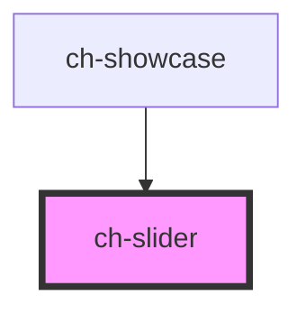

# ch-slider

<!-- Auto Generated Below -->

## Overview

The slider control is a input where the user selects a value from within a given range.

## Properties

| Property         | Attribute         | Description                                                                                                                                                                                                                                                                                                                          | Type      | Default     |
| ---------------- | ----------------- | ------------------------------------------------------------------------------------------------------------------------------------------------------------------------------------------------------------------------------------------------------------------------------------------------------------------------------------ | --------- | ----------- |
| `accessibleName` | `accessible-name` | Specifies a short string, typically 1 to 3 words, that authors associate with an element to provide users of assistive technologies with a label for the element.                                                                                                                                                                    | `string`  | `undefined` |
| `disabled`       | `disabled`        | This attribute allows you specify if the element is disabled. If disabled, it will not trigger any user interaction related event (for example, click event).                                                                                                                                                                        | `boolean` | `false`     |
| `maxValue`       | `max-value`       | This attribute lets you specify maximum value of the slider.                                                                                                                                                                                                                                                                         | `number`  | `5`         |
| `minValue`       | `min-value`       | This attribute lets you specify minimum value of the slider.                                                                                                                                                                                                                                                                         | `number`  | `0`         |
| `showValue`      | `show-value`      | This attribute lets you indicate whether the control should display a bubble with the current value upon interaction.                                                                                                                                                                                                                | `boolean` | `false`     |
| `step`           | `step`            | This attribute lets you specify the step of the slider.  This attribute is useful when the values of the slider can only take some discrete values. For example, if valid values are `[10, 20, 30]` set the `minValue` to `10`, the maxValue to `30`, and the step to `10`. If the step is `0`, the any intermediate value is valid. | `number`  | `1`         |
| `value`          | `value`           | The value of the control.                                                                                                                                                                                                                                                                                                            | `number`  | `0`         |

## Events

| Event    | Description                                                                                  | Type                  |
| -------- | -------------------------------------------------------------------------------------------- | --------------------- |
| `change` | The `change` event is emitted when a change to the element's value is committed by the user. | `CustomEvent<number>` |
| `input`  | The `input` event is fired synchronously when the value is changed.                          | `CustomEvent<number>` |

## Shadow Parts

| Part                  | Description                                                                                                                                             |
| --------------------- | ------------------------------------------------------------------------------------------------------------------------------------------------------- |
| `"disabled"`          | Present in all parts when the control is disabled (`disabled` === `true`).                                                                              |
| `"thumb"`             | The thumb of the slider element.                                                                                                                        |
| `"track"`             | The track of the slider element.                                                                                                                        |
| `"track__selected"`   | Represents the portion of the track that is selected, that is, the portion of the track that starts at the min value and goes to the current value.     |
| `"track__unselected"` | Represents the portion of the track that is not selected, that is, the portion of the track that starts at the current value and goes to the max value. |

## CSS Custom Properties

| Name                                             | Description                                                                                                                       |
| ------------------------------------------------ | --------------------------------------------------------------------------------------------------------------------------------- |
| `--ch-slider-thumb-background-color`             | Specifies the background-color of the thumb. @default currentColor                                                                |
| `--ch-slider-thumb-size`                         | Specifies the size of the thumb. @default clamp(8px, 1.5em, 24px)                                                                 |
| `--ch-slider-track-block-size`                   | Specifies the block size of the track. @default clamp(3px, 0.25em, 16px)                                                          |
| `--ch-slider-track__selected-background-color`   | Specifies the background-color of the selected portion of the track. @default color-mix(in srgb, currentColor 15%, transparent)   |
| `--ch-slider-track__unselected-background-color` | Specifies the background-color of the unselected portion of the track. @default color-mix(in srgb, currentColor 15%, transparent) |

## Dependencies

### Used by

 - [ch-showcase](../../showcase/assets/components)

### Graph

----------------------------------------------

*Built with [StencilJS](https://stenciljs.com/)*
