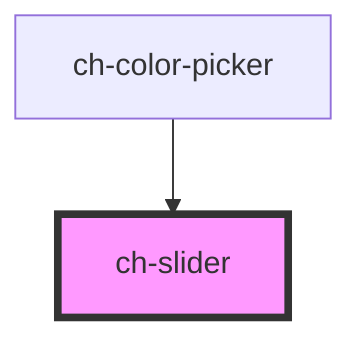

# ch-slider

## Table of Contents

- [Overview](#overview)
- [Features](#features)
- [Use when](#use-when)
- [Do not use when](#do-not-use-when)
- [Slots](#slots)
- [Accessibility](#accessibility)
- [Properties](#properties)
- [Events](#events)
- [Dependencies](#dependencies)
  - [Used by](#used-by)
  - [Graph](#graph)
- [Styling](./docs/styling.md)

<!-- Auto Generated Below -->

## Overview

The `ch-slider` component is a range input that lets users select a numeric value by dragging a thumb along a track between a configurable minimum and maximum.

## Features
 - Configurable minimum, maximum, and step values.
 - Optional value bubble display on interaction.
 - Visual track split into selected and unselected portions.
 - Form-associated via `ElementInternals`.

## Use when
 - Continuous or stepped numeric adjustments are needed, such as volume controls, price ranges, or thresholds.
 - The relative position within a range is meaningful (e.g., volume, opacity, zoom level).
 - An approximate value is acceptable (e.g., price range filter).

## Do not use when
 - A star-based discrete rating is needed — prefer `ch-rating` instead.
 - Precise numeric entry is required — prefer `ch-edit` with `type="number"` instead.
 - An exact numeric value is required — combine with or replace with `ch-edit` with `type="number"`.
 - The range is very small (2–3 discrete steps) — prefer `ch-radio-group-render`.
 - The range is extremely large (e.g., 0–1,000,000) and precision matters — use `ch-edit` instead.
 - Increments are qualitative (e.g., Small/Medium/Large) — prefer `ch-radio-group-render`.

## Slots
 - No slots. All content is rendered internally.

## Accessibility
 - Form-associated via `ElementInternals` — participates in native form validation and submission.
 - Delegates focus into the shadow DOM (`delegatesFocus: true`).
 - Uses a native `<input type="range">` which provides built-in keyboard support: Arrow keys increment/decrement by `step`, Page Up/Down for larger jumps, Home/End to jump to min/max.
 - Resolves its accessible name from an external `<label>` element or the `accessibleName` property.
 - The decorative track overlay is hidden from assistive technology with `aria-hidden`.

## Properties

| Property         | Attribute         | Description                                                                                                                                                                                                                                                                                                                          | Type      | Default     |
| ---------------- | ----------------- | ------------------------------------------------------------------------------------------------------------------------------------------------------------------------------------------------------------------------------------------------------------------------------------------------------------------------------------ | --------- | ----------- |
| `accessibleName` | `accessible-name` | Specifies a short string, typically 1 to 3 words, that authors associate with an element to provide users of assistive technologies with a label for the element.                                                                                                                                                                    | `string`  | `undefined` |
| `disabled`       | `disabled`        | This attribute allows you specify if the element is disabled. If disabled, it will not trigger any user interaction related event (for example, click event).                                                                                                                                                                        | `boolean` | `false`     |
| `maxValue`       | `max-value`       | This attribute lets you specify maximum value of the slider. If `maxValue` is less than `minValue`, it is silently raised to `minValue` (`Math.max(minValue, maxValue)` is applied internally).                                                                                                                                      | `number`  | `5`         |
| `minValue`       | `min-value`       | This attribute lets you specify minimum value of the slider.                                                                                                                                                                                                                                                                         | `number`  | `0`         |
| `showValue`      | `show-value`      | This attribute lets you indicate whether the control should display a bubble with the current value upon interaction.                                                                                                                                                                                                                | `boolean` | `false`     |
| `step`           | `step`            | This attribute lets you specify the step of the slider.  This attribute is useful when the values of the slider can only take some discrete values. For example, if valid values are `[10, 20, 30]` set the `minValue` to `10`, the maxValue to `30`, and the step to `10`. If the step is `0`, the any intermediate value is valid. | `number`  | `1`         |
| `value`          | `value`           | The value of the control. The `@Watch` handler syncs the value with `ElementInternals.setFormValue()` on every change.                                                                                                                                                                                                               | `number`  | `0`         |

## Events

| Event    | Description                                                                                                                                     | Type                  |
| -------- | ----------------------------------------------------------------------------------------------------------------------------------------------- | --------------------- |
| `change` | The `change` event is emitted when a change to the element's value is committed by the user (e.g. on mouseup / touchend). Not debounced.        | `CustomEvent<number>` |
| `input`  | The `input` event is fired on every drag step as the user moves the thumb. Updates are batched through `requestAnimationFrame` for performance. | `CustomEvent<number>` |

## Dependencies

### Used by

 - [ch-color-picker](../color-picker)

### Graph

```mermaid
graph TD;
  ch-color-picker --> ch-slider
  style ch-slider fill:#f9f,stroke:#333,stroke-width:4px
```

----------------------------------------------

*Built with [StencilJS](https://stenciljs.com/)*
