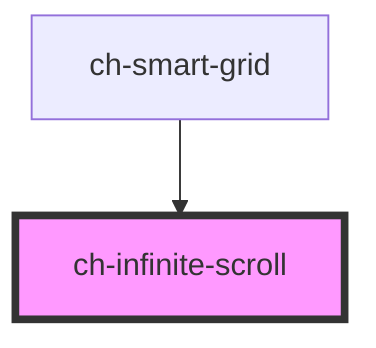

# ch-infinite-scroll

<!-- Auto Generated Below -->

## Properties

| Property                                        | Attribute       | Description                                                                                                                                                                                                                                                                                                                                                                                               | Type                                                                     | Default     |
| ----------------------------------------------- | --------------- | --------------------------------------------------------------------------------------------------------------------------------------------------------------------------------------------------------------------------------------------------------------------------------------------------------------------------------------------------------------------------------------------------------- | ------------------------------------------------------------------------ | ----------- |
| `dataProvider`                                  | `data-provider` | `true` if the infinite scroll is used in a grid that has data provider. This attribute determine the utility of the infinite scroll, because in certain configurations the infinite scroll can be used only to implement the inverse loading utility.                                                                                                                                                     | `boolean`                                                                | `false`     |
| `infiniteThresholdReachedCallback` _(required)_ | --              | This Handler will be called every time grid threshold is reached. Needed for infinite scrolling grids.                                                                                                                                                                                                                                                                                                    | `() => void`                                                             | `undefined` |
| `loadingState` _(required)_                     | `loading-state` | If `true`, the infinite scroll will be hidden and scroll event listeners will be removed.  Set this to `false` to disable the infinite scroll from actively trying to receive new data while reaching the threshold. This is useful when it is known that there is no more data that can be added, and the infinite scroll is no longer needed.                                                           | `"all-records-loaded" \| "initial" \| "loading" \| "more-data-to-fetch"` | `undefined` |
| `position`                                      | `position`      | The position of the infinite scroll element. The value can be either `top` or `bottom`. When `position === "top"`, the control also implements inverse loading.                                                                                                                                                                                                                                           | `"bottom" \| "top"`                                                      | `"bottom"`  |
| `threshold`                                     | `threshold`     | The threshold distance from the bottom of the content to call the `infinite` output event when scrolled. The threshold value can be either a percent, or in pixels. For example, use the value of `10%` for the `infinite` output event to get called when the user has scrolled 10% from the bottom of the page. Use the value `100px` when the scroll is within 100 pixels from the bottom of the page. | `string`                                                                 | `"15%"`     |

## Methods

### `complete() => Promise<void>`

Call `complete()` within the `gxInfinite` output event handler when
your async operation has completed. For example, the `loading`
state is while the app is performing an asynchronous operation,
such as receiving more data from an AJAX request to add more items
to a data list. Once the data has been received and UI updated, you
then call this method to signify that the loading has completed.
This method will change the infinite scroll's state from `loading`
to `enabled`.

#### Returns

Type: `Promise<void>`

## Dependencies

### Used by

 - [ch-smart-grid](../..)

### Graph

----------------------------------------------

*Built with [StencilJS](https://stenciljs.com/)*
