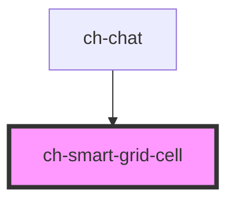

# ch-smart-grid-cell

<!-- Auto Generated Below -->

## Properties

| Property              | Attribute | Description                   | Type     | Default     |
| --------------------- | --------- | ----------------------------- | -------- | ----------- |
| `cellId` _(required)_ | `cell-id` | Specifies the ID of the cell. | `string` | `undefined` |

## Events

| Event              | Description                                                               | Type                  |
| ------------------ | ------------------------------------------------------------------------- | --------------------- |
| `smartCellDidLoad` | Fired when the component and all its child did render for the first time. | `CustomEvent<string>` |

## Dependencies

### Used by

 - [ch-chat](../../../chat)

### Graph

----------------------------------------------

*Built with [StencilJS](https://stenciljs.com/)*
