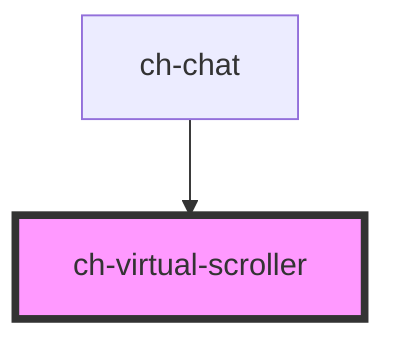

# ch-smart-grid-virtual-scroller

<!-- Auto Generated Below -->

## Properties

| Property                     | Attribute                       | Description                                                                                                                                                                                                                                                                                                                                                              | Type                                | Default            |
| ---------------------------- | ------------------------------- | ------------------------------------------------------------------------------------------------------------------------------------------------------------------------------------------------------------------------------------------------------------------------------------------------------------------------------------------------------------------------ | ----------------------------------- | ------------------ |
| `bufferAmount`               | `buffer-amount`                 | The number of elements to be rendered above and below the current container's viewport.                                                                                                                                                                                                                                                                                  | `number`                            | `5`                |
| `initialRenderViewportItems` | `initial-render-viewport-items` | Specifies an estimation for the items that will enter in the viewport of the initial render.                                                                                                                                                                                                                                                                             | `number`                            | `10`               |
| `inverseLoading`             | `inverse-loading`               | When set to `true`, the grid items will be loaded in inverse order, with the scroll positioned at the bottom on the initial load.  If `mode="virtual-scroll"`, only the items at the start of the viewport that are not visible will be removed from the DOM. The items at the end of the viewport that are not visible will remain rendered to avoid flickering issues. | `boolean`                           | `false`            |
| `items` _(required)_         | --                              | The array of items to be rendered in the ch-smart-grid.                                                                                                                                                                                                                                                                                                                  | `SmartGridItem[]`                   | `undefined`        |
| `itemsCount`                 | `items-count`                   | The number of elements in the items array. Use if the array changes, without recreating the array.                                                                                                                                                                                                                                                                       | `number`                            | `undefined`        |
| `mode`                       | `mode`                          | Specifies how the control will behave.                                                                                                                                                                                                                                                                                                                                   | `"lazy-render" \| "virtual-scroll"` | `"virtual-scroll"` |

## Events

| Event                    | Description                                                                           | Type                                                                                                       |
| ------------------------ | ------------------------------------------------------------------------------------- | ---------------------------------------------------------------------------------------------------------- |
| `virtualItemsChanged`    | Emitted when the array of visible items in the ch-smart-grid changes.                 | `CustomEvent<{ virtualItems: SmartGridModel; startIndex: number; endIndex: number; totalItems: number; }>` |
| `virtualScrollerDidLoad` | Fired when the visible content of the virtual scroller did render for the first time. | `CustomEvent<any>`                                                                                         |

## Methods

### `addItems(position: "start" | "end", ...items: SmartGridModel) => Promise<void>`

Add items to the beginning or end of the items property. This method is
useful for adding new items to the collection, without impacting in the
internal indexes used to display the virtual items. Without this method,
the virtual scroll would behave unexpectedly when new items are added.

#### Parameters

| Name       | Type               | Description |
| ---------- | ------------------ | ----------- |
| `position` | `"start" \| "end"` |             |
| `items`    | `SmartGridItem[]`  |             |

#### Returns

Type: `Promise<void>`

## Dependencies

### Used by

 - [ch-chat](../../../chat)

### Graph

----------------------------------------------

*Built with [StencilJS](https://stenciljs.com/)*
