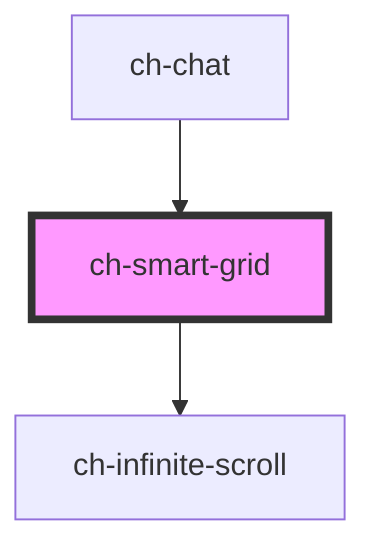

# ch-smart-grid

<!-- Auto Generated Below -->

## Properties

| Property                  | Attribute         | Description                                                                                                                                                                                                                                                                                                                                                                                               | Type                                                                     | Default     |
| ------------------------- | ----------------- | --------------------------------------------------------------------------------------------------------------------------------------------------------------------------------------------------------------------------------------------------------------------------------------------------------------------------------------------------------------------------------------------------------- | ------------------------------------------------------------------------ | ----------- |
| `accessibleName`          | `accessible-name` | Specifies a short string, typically 1 to 3 words, that authors associate with an element to provide users of assistive technologies with a label for the element.                                                                                                                                                                                                                                         | `string`                                                                 | `undefined` |
| `autoGrow`                | `auto-grow`       | This attribute defines if the control size will grow automatically, to adjust to its content size. If set to `false`, it won't grow automatically and it will show scrollbars if the content overflows.                                                                                                                                                                                                   | `boolean`                                                                | `false`     |
| `dataProvider`            | `data-provider`   | `true` if the control has a data provider and therefore must implement a infinite scroll to load data.                                                                                                                                                                                                                                                                                                    | `boolean`                                                                | `false`     |
| `inverseLoading`          | `inverse-loading` | When set to `true`, the grid items will be loaded in inverse order, with the first element at the bottom and the "Loading" message (infinite-scroll) at the top.                                                                                                                                                                                                                                          | `boolean`                                                                | `false`     |
| `itemsCount` _(required)_ | `items-count`     | Grid current row count. This property is used in order to be able to re-render the Grid every time the Grid data changes. If not specified, then grid empty and loading placeholders may not work correctly.                                                                                                                                                                                              | `number`                                                                 | `undefined` |
| `loadingState`            | `loading-state`   | Specifies the loading state of the grid.                                                                                                                                                                                                                                                                                                                                                                  | `"all-records-loaded" \| "initial" \| "loading" \| "more-data-to-fetch"` | `"initial"` |
| `threshold`               | `threshold`       | The threshold distance from the bottom of the content to call the `infinite` output event when scrolled. The threshold value can be either a percent, or in pixels. For example, use the value of `10%` for the `infinite` output event to get called when the user has scrolled 10% from the bottom of the page. Use the value `100px` when the scroll is within 100 pixels from the bottom of the page. | `string`                                                                 | `"10px"`    |

## Events

| Event                      | Description                                                                                            | Type                |
| -------------------------- | ------------------------------------------------------------------------------------------------------ | ------------------- |
| `infiniteThresholdReached` | This Handler will be called every time grid threshold is reached. Needed for infinite scrolling grids. | `CustomEvent<void>` |

## Dependencies

### Used by

 - [ch-chat](../chat)

### Depends on

- [ch-infinite-scroll](./internal/infinite-scroll)

### Graph

----------------------------------------------

*Built with [StencilJS](https://stenciljs.com/)*
