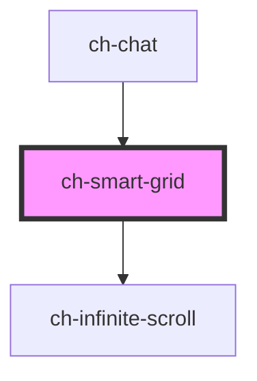

# ch-smart-grid

<!-- Auto Generated Below -->

## Overview

The `ch-smart-grid` component is an accessible grid layout for data-driven applications that require infinite scrolling, virtual rendering, and dynamic content loading.

## Features
 - Infinite scrolling via `ch-infinite-scroll` integration with configurable thresholds.
 - Standard and inverse loading orders (newest items at the bottom or top).
 - Automatic scroll-position management to prevent layout shifts (CLS) during async content loads.
 - Anchor a specific cell at the top of the viewport with reserved space, similar to code editors (via `scrollEndContentToPosition`).
 - Auto-grow mode (`autoGrow`) to adjust size to content, or fixed size with scrollbars.
 - ARIA live-region support for accessible announcements.
 - Virtual-scroller integration for rendering only visible items.

## Use when
 - Building chat-like interfaces with inverse loading.
 - Displaying large, dynamically loaded data sets with virtual scrolling.
 - Infinite-scroll or paginated feeds with bottom-to-top inverse loading (e.g., chat, activity streams).

## Do not use when
 - Displaying static tabular data with columns and headers -- use `ch-tabular-grid` instead.
 - A fixed, non-scrollable list is sufficient -- prefer `ch-action-list-render`.

## Accessibility
 - The host element uses `aria-live="polite"` to announce content changes to assistive technologies.
 - `aria-busy` is set to `"true"` during `"initial"` and `"loading"` states, preventing premature announcements.
 - The `accessibleName` property maps to `aria-label` on the host.

## Properties

| Property                  | Attribute         | Description                                                                                                                                                                                                                                                                                                                                                                                                                                                                                                         | Type                                                                     | Default           |
| ------------------------- | ----------------- | ------------------------------------------------------------------------------------------------------------------------------------------------------------------------------------------------------------------------------------------------------------------------------------------------------------------------------------------------------------------------------------------------------------------------------------------------------------------------------------------------------------------- | ------------------------------------------------------------------------ | ----------------- |
| `accessibleName`          | `accessible-name` | Specifies a short string, typically 1 to 3 words, that authors associate with an element to provide users of assistive technologies with a label for the element.                                                                                                                                                                                                                                                                                                                                                   | `string`                                                                 | `undefined`       |
| `autoGrow`                | `auto-grow`       | When `true`, the control size grows automatically to fit its content (no scrollbars). When `false`, the control has a fixed size and shows scrollbars if the content overflows.  When `false`, the `ch-scrollable` class is applied to the host, enabling `contain: strict` and `overflow: auto`.  Interacts with `inverseLoading`: when both `autoGrow` and `inverseLoading` are `true`, the CLS-avoidance opacity class is removed after the first render instead of waiting for the virtual-scroller load event. | `boolean`                                                                | `false`           |
| `autoScroll`              | `auto-scroll`     | Specifies how the scroll position will be adjusted when the content size changes when using `inverseLoading = true`.   - "at-scroll-end": If the scroll is positioned at the end of the content,   the chat will maintain the scroll at the end while the content size   changes.   - "never": The scroll position won't be adjusted when the content size   changes.                                                                                                                                               | `"at-scroll-end" \| "never"`                                             | `"at-scroll-end"` |
| `dataProvider`            | `data-provider`   | `true` if the control has an external data provider and therefore must implement infinite scrolling to load data progressively. When `true`, a `ch-infinite-scroll` element is rendered at the top (if `inverseLoading`) or bottom of the grid content.                                                                                                                                                                                                                                                             | `boolean`                                                                | `false`           |
| `inverseLoading`          | `inverse-loading` | When set to `true`, the grid items will be loaded in inverse order, with the first element at the bottom and the "Loading" message (infinite-scroll) at the top.                                                                                                                                                                                                                                                                                                                                                    | `boolean`                                                                | `false`           |
| `itemsCount` _(required)_ | `items-count`     | The current number of items (rows/cells) in the grid. This is a required property used to trigger re-renders whenever the data set changes. When `itemsCount` is `0`, the `grid-content-empty` slot is rendered instead of `grid-content`.  If not specified, grid empty and loading placeholders may not work correctly.                                                                                                                                                                                           | `number`                                                                 | `undefined`       |
| `loadingState`            | `loading-state`   | Specifies the loading state of the grid:  - `"initial"`: First load; shows the `grid-initial-loading-placeholder`    slot.  - `"loading"`: Data is being fetched (infinite scroll triggered). The    `ch-infinite-scroll` component shows its loading indicator.  - `"loaded"`: Data fetch is complete. Normal content is rendered.  This property is mutable: the component sets it to `"loading"` when the infinite-scroll threshold is reached.                                                                  | `"all-records-loaded" \| "initial" \| "loading" \| "more-data-to-fetch"` | `"initial"`       |
| `threshold`               | `threshold`       | The threshold distance from the bottom of the content to call the `infinite` output event when scrolled. The threshold value can be either a percent, or in pixels. For example, use the value of `10%` for the `infinite` output event to get called when the user has scrolled 10% from the bottom of the page. Use the value `100px` when the scroll is within 100 pixels from the bottom of the page.                                                                                                           | `string`                                                                 | `"10px"`          |

## Events

| Event                      | Description                                                                                                                                                                                                                                                                                                                               | Type                |
| -------------------------- | ----------------------------------------------------------------------------------------------------------------------------------------------------------------------------------------------------------------------------------------------------------------------------------------------------------------------------------------- | ------------------- |
| `infiniteThresholdReached` | Emitted every time the infinite-scroll threshold is reached. The host should respond by fetching the next page of data and updating `loadingState` back to `"loaded"` when done.  Does not bubble (`bubbles: false`). Not cancelable. Payload is `void`. Before emitting, the component automatically sets `loadingState` to `"loading"`. | `CustomEvent<void>` |

## Methods

### `removeScrollEndContentReference() => Promise<void>`

Removes the cell reference that is aligned at the start of the viewport.

In other words, removes the reserved space that is used to aligned
`scrollEndContentToPosition(cellId, { position: "start" })`

#### Returns

Type: `Promise<void>`

### `scrollEndContentToPosition(cellId: string, options: { position: "start" | "end"; behavior?: ScrollBehavior; }) => Promise<void>`

Scrolls the grid so that the cell identified by `cellId` is aligned at
the `"start"` or `"end"` of the viewport.

When `position === "start"`, the component reserves extra space after
the last cell (similar to how the Monaco editor reserves space for the
last lines) to keep the anchor cell visible at the top even when there
is not enough content below it.

The reserved space is automatically recalculated as cells are added or
removed. Call `removeScrollEndContentReference()` to clear the anchor.

#### Parameters

| Name      | Type                                                         | Description |
| --------- | ------------------------------------------------------------ | ----------- |
| `cellId`  | `string`                                                     |             |
| `options` | `{ position: "start" \| "end"; behavior?: ScrollBehavior; }` |             |

#### Returns

Type: `Promise<void>`

## Slots

| Slot                                 | Description                                                                                                      |
| ------------------------------------ | ---------------------------------------------------------------------------------------------------------------- |
| `"grid-content"`                     | Primary content slot for grid cells. Rendered when the grid has records and is not in the initial loading state. |
| `"grid-content-empty"`               | Fallback content displayed when the grid has finished loading but contains no records.                           |
| `"grid-initial-loading-placeholder"` | Placeholder content shown during the initial loading state before any data has been fetched.                     |

## Dependencies

### Used by

 - [ch-chat](../chat)

### Depends on

- [ch-infinite-scroll](./internal/infinite-scroll)

### Graph

```mermaid
graph TD;
  ch-smart-grid --> ch-infinite-scroll
  ch-chat --> ch-smart-grid
  style ch-smart-grid fill:#f9f,stroke:#333,stroke-width:4px
```

----------------------------------------------

*Built with [StencilJS](https://stenciljs.com/)*
