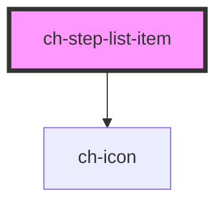

# ch-step-list-item

<!-- Auto Generated Below -->

## Properties

| Property  | Attribute  | Description            | Type     | Default     |
| --------- | ---------- | ---------------------- | -------- | ----------- |
| `iconSrc` | `icon-src` | Set the left side icon | `string` | `undefined` |

## Events

| Event         | Description       | Type               |
| ------------- | ----------------- | ------------------ |
| `itemClicked` | Emits the item id | `CustomEvent<any>` |

## CSS Custom Properties

| Name                  | Description                  |
| --------------------- | ---------------------------- |
| `--font-family`       | The select's font family     |
| `--font-size`         | The item's font size         |
| `--font-weight`       | The item's font weight       |
| `--item-active-color` | The color of the active item |
| `--item-color`        | The color of the step item   |
| `--line-color`        | The color of item's line     |
| `--text-color`        | The color of the text        |

## Dependencies

### Depends on

- [ch-icon](../icon)

### Graph

----------------------------------------------

*Built with [StencilJS](https://stenciljs.com/)*
