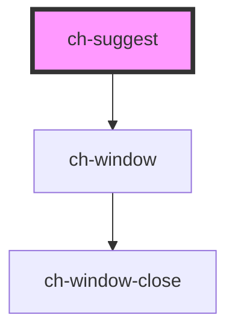

# ch-suggest

<!-- Auto Generated Below -->

## Properties

| Property   | Attribute  | Description                                                                                                                           | Type     | Default     |
| ---------- | ---------- | ------------------------------------------------------------------------------------------------------------------------------------- | -------- | ----------- |
| `debounce` | `debounce` | The debounce amount in milliseconds (This is the time the suggest waits after the user has finished typing, to show the suggestions). | `500`    | `500`       |
| `label`    | `label`    | The label                                                                                                                             | `string` | `undefined` |
| `value`    | `value`    | The input value                                                                                                                       | `string` | `undefined` |

## Events

| Event          | Description                                                                                     | Type                  |
| -------------- | ----------------------------------------------------------------------------------------------- | --------------------- |
| `inputChanged` | This event is emitted every time there input events fires, and it emits the actual input value. | `CustomEvent<string>` |

## Shadow Parts

| Part          | Description |
| ------------- | ----------- |
| `"ch-window"` |             |
| `"input"`     |             |
| `"label"`     |             |

## Dependencies

### Depends on

- [ch-window](../window)

### Graph

----------------------------------------------

*Built with [StencilJS](https://stenciljs.com/)*
