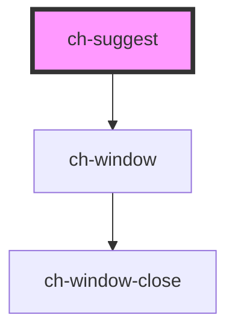

# ch-suggest

<!-- Auto Generated Below -->

## Properties

| Property        | Attribute        | Description                                                                                                                                                                                        | Type                 | Default     |
| --------------- | ---------------- | -------------------------------------------------------------------------------------------------------------------------------------------------------------------------------------------------- | -------------------- | ----------- |
| `cursorEnd`     | `cursor-end`     | If true, it will position the cursor at the end when the input is focused.                                                                                                                         | `boolean`            | `false`     |
| `debounce`      | `debounce`       | The debounce amount in milliseconds (This is the time the suggest waits after the user has finished typing, to show the suggestions).                                                              | `number`             | `500`       |
| `label`         | `label`          | The label                                                                                                                                                                                          | `string`             | `undefined` |
| `labelPosition` | `label-position` | The label position                                                                                                                                                                                 | `"above" \| "start"` | `"start"`   |
| `showHeader`    | `show-header`    | Wether or not the suggest has a header. The header will show the "suggestTitle" if provided, and a close button.                                                                                   | `boolean`            | `false`     |
| `showLabel`     | `show-label`     | Whether or not to display the label                                                                                                                                                                | `boolean`            | `true`      |
| `suggestTitle`  | `suggest-title`  | The suggest title (optional). This is not the same as the "label", rather, this is the title that will appear inside the dropdown. This title will only be visible if "showHeader" is set to true. | `string`             | `undefined` |
| `value`         | `value`          | This is the suggest value.                                                                                                                                                                         | `string`             | `undefined` |

## Events

| Event          | Description                                                                                     | Type                  |
| -------------- | ----------------------------------------------------------------------------------------------- | --------------------- |
| `inputChanged` | This event is emitted every time there input events fires, and it emits the actual input value. | `CustomEvent<string>` |

## Methods

### `selectInputText() => Promise<void>`

#### Returns

Type: `Promise<void>`

## Shadow Parts

| Part                    | Description |
| ----------------------- | ----------- |
| `"input"`               |             |
| `"label"`               |             |
| `"label-input-wrapper"` |             |
| `"main-wrapper"`        |             |

## Dependencies

### Depends on

- [ch-window](../window)

### Graph

----------------------------------------------

*Built with [StencilJS](https://stenciljs.com/)*
