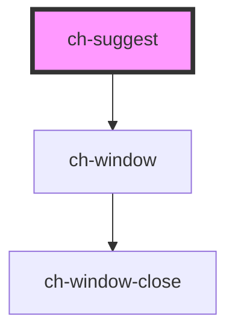

# ch-suggest

<!-- Auto Generated Below -->

## Properties

| Property | Attribute | Description     | Type     | Default     |
| -------- | --------- | --------------- | -------- | ----------- |
| `label`  | `label`   | The label       | `string` | `undefined` |
| `value`  | `value`   | The input value | `string` | `undefined` |

## Events

| Event          | Description                                                                   | Type                  |
| -------------- | ----------------------------------------------------------------------------- | --------------------- |
| `inputChanged` | ***************************** 5.EVENTS (EMMIT) ****************************** | `CustomEvent<string>` |

## Shadow Parts

| Part                    | Description |
| ----------------------- | ----------- |
| `"ch-window-container"` |             |
| `"input"`               |             |
| `"label"`               |             |

## Dependencies

### Depends on

- [ch-window](../window)

### Graph

----------------------------------------------

*Built with [StencilJS](https://stenciljs.com/)*
