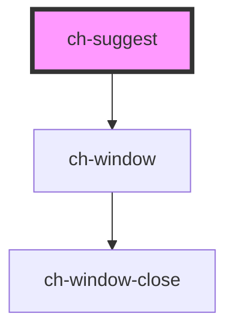

# ch-suggest

The ch-suggest component is an input (text field) with the additional functionality of suggesting autocomplete options (ch-suggest-list-item) as the user modifies the text. The options can be displayed as a simple list or grouped into categories (ch-suggest-list).

<!-- Auto Generated Below -->

## Properties

| Property   | Attribute  | Description                                                                                                                          | Type     | Default     |
| ---------- | ---------- | ------------------------------------------------------------------------------------------------------------------------------------ | -------- | ----------- |
| `debounce` | `debounce` | The debounce amount in miliseconds (This is the time the suggest waits after the user has finished typing, to show the suggestions). | `500`    | `500`       |
| `label`    | `label`    | The label                                                                                                                            | `string` | `undefined` |
| `value`    | `value`    | The input value                                                                                                                      | `string` | `undefined` |

## Events

| Event          | Description                                                                      | Type                  |
| -------------- | -------------------------------------------------------------------------------- | --------------------- |
| `inputChanged` | **************\*************** 5.EVENTS (EMMIT) **************\*\*************** | `CustomEvent<string>` |

## Shadow Parts

| Part      | Description |
| --------- | ----------- |
| `"input"` |             |
| `"label"` |             |

## Dependencies

### Depends on

- [ch-window](../window)

### Graph

---

_Built with [StencilJS](https://stenciljs.com/)_
