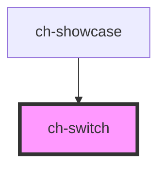

# ch-switch

<!-- Auto Generated Below -->

## Properties

| Property                    | Attribute            | Description                                                                                                                                                                            | Type      | Default     |
| --------------------------- | -------------------- | -------------------------------------------------------------------------------------------------------------------------------------------------------------------------------------- | --------- | ----------- |
| `accessibleName`            | `accessible-name`    | Specifies a short string, typically 1 to 3 words, that authors associate with an element to provide users of assistive technologies with a label for the element.                      | `string`  | `undefined` |
| `checkedCaption`            | `checked-caption`    | Caption displayed when the switch is 'on'                                                                                                                                              | `string`  | `undefined` |
| `checkedValue` _(required)_ | `checked-value`      | The value when the switch is 'on'                                                                                                                                                      | `string`  | `undefined` |
| `disabled`                  | `disabled`           | This attribute allows you specify if the element is disabled. If disabled, it will not trigger any user interaction related event (for example, click event).                          | `boolean` | `false`     |
| `name`                      | `name`               | This property specifies the `name` of the control when used in a form.                                                                                                                 | `string`  | `undefined` |
| `unCheckedCaption`          | `un-checked-caption` | Caption displayed when the switch is 'off'                                                                                                                                             | `string`  | `undefined` |
| `unCheckedValue`            | `un-checked-value`   | The value when the switch is 'off'. If you want to not add the value when the control is used in a form and it's unchecked, just let this property with the default `undefined` value. | `string`  | `undefined` |
| `value`                     | `value`              | The value of the control.                                                                                                                                                              | `string`  | `null`      |

## Events

| Event   | Description                                                                                 | Type               |
| ------- | ------------------------------------------------------------------------------------------- | ------------------ |
| `input` | The 'input' event is emitted when a change to the element's value is committed by the user. | `CustomEvent<any>` |

## Shadow Parts

| Part          | Description                                                                                                       |
| ------------- | ----------------------------------------------------------------------------------------------------------------- |
| `"caption"`   | The caption (checked or unchecked) of the switch element.                                                         |
| `"checked"`   | Present in the `track`, `thumb` and `caption` parts when the control is checked (`value` === `checkedValue`).     |
| `"disabled"`  | Present in the `track`, `thumb` and `caption` parts when the control is disabled (`disabled` === `true`).         |
| `"thumb"`     | The thumb of the switch element.                                                                                  |
| `"track"`     | The track of the switch element.                                                                                  |
| `"unchecked"` | Present in the `track`, `thumb` and `caption` parts when the control is unchecked (`value` === `unCheckedValue`). |

## CSS Custom Properties

| Name                                            | Description                                                                                                                       |
| ----------------------------------------------- | --------------------------------------------------------------------------------------------------------------------------------- |
| `--ch-switch-thumb-size`                        | Specifies the size of the thumb. @default clamp(8px, 1em, 24px)                                                                   |
| `--ch-switch-thumb__checked-background-color`   | Specifies the background color of the thumb when the control is unchecked. @default currentColor                                  |
| `--ch-switch-thumb__state-transition-duration`  | Specifies the transition duration of the thumb when switching between states. @default 0ms                                        |
| `--ch-switch-thumb__unchecked-background-color` | Specifies the background color of the thumb when the control is unchecked. @default #b2b2b2                                       |
| `--ch-switch-track-block-size`                  | Specifies the block size of the track. @default clamp(3px, 0.5em, 16px)                                                           |
| `--ch-switch-track-inline-size`                 | Specifies the inline size of the track. @default clamp(3px, 0.5em, 16px)                                                          |
| `--ch-switch-track__checked-background-color`   | Specifies the background color of the track when the control is checked. @default color-mix(in srgb, currentColor 35%, #b2b2b2)   |
| `--ch-switch-track__unchecked-background-color` | Specifies the background color of the track when the control is unchecked. @default color-mix(in srgb, currentColor 35%, #b2b2b2) |

## Dependencies

### Used by

 - [ch-showcase](../../showcase/assets/components)

### Graph

----------------------------------------------

*Built with [StencilJS](https://stenciljs.com/)*
