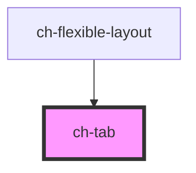

# ch-tab

<!-- Auto Generated Below -->

## Properties

| Property                    | Attribute                      | Description                                                                                                                                                                                                                | Type                                                   | Default     |
| --------------------------- | ------------------------------ | -------------------------------------------------------------------------------------------------------------------------------------------------------------------------------------------------------------------------- | ------------------------------------------------------ | ----------- |
| `accessibleName`            | `accessible-name`              | Specifies a short string, typically 1 to 3 words, that authors associate with an element to provide users of assistive technologies with a label for the element.                                                          | `string`                                               | `undefined` |
| `closeButtonAccessibleName` | `close-button-accessible-name` | Specifies a short string, typically 1 to 3 words, that authors associate with an element to provide users of assistive technologies with a label for the element. This label is used for the close button of the captions. | `string`                                               | `"Close"`   |
| `expanded`                  | `expanded`                     | `true` if the group has is view section expanded. Otherwise, only the toolbar will be displayed.                                                                                                                           | `boolean`                                              | `true`      |
| `items`                     | --                             | Specifies the items that are displayed in the group.                                                                                                                                                                       | `FlexibleLayoutWidget[]`                               | `undefined` |
| `showPageName`              | `show-page-name`               | `true` to display the name of the page.                                                                                                                                                                                    | `boolean`                                              | `true`      |
| `type`                      | `type`                         | Specifies the flexible layout type.                                                                                                                                                                                        | `"blockEnd" \| "inlineEnd" \| "inlineStart" \| "main"` | `undefined` |

## Events

| Event                | Description                                             | Type                                                                                                          |
| -------------------- | ------------------------------------------------------- | ------------------------------------------------------------------------------------------------------------- |
| `expandMainGroup`    | Fired when an item of the main group is double clicked. | `CustomEvent<string>`                                                                                         |
| `itemClose`          | Fired the close button of an item is clicked.           | `CustomEvent<string>`                                                                                         |
| `selectedItemChange` | Fired when the selected item change.                    | `CustomEvent<{ lastSelectedIndex: number; newSelectedId: string; newSelectedIndex: number; type: TabType; }>` |

## Dependencies

### Used by

 - [ch-flexible-layout](../flexible-layout/flexible-layout)

### Graph

----------------------------------------------

*Built with [StencilJS](https://stenciljs.com/)*
